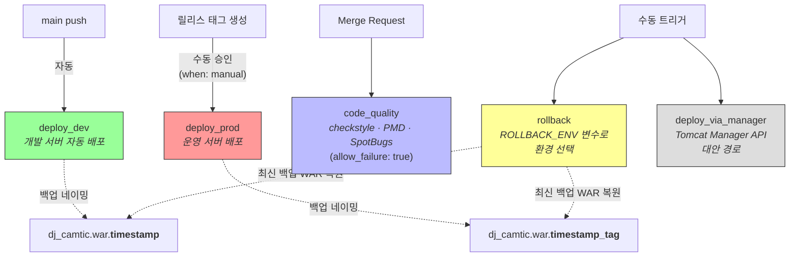

# CI/CD 파이프라인

## 초기 상태

| | Before | After |
|---|---|---|
| 배포 방식 | WAR 수동 복사 → Tomcat 수동 재시작 | GitLab CI/CD 자동 파이프라인 |
| 환경 분리 | 수동 설정 파일 교체 | Spring Profile (`dev`/`prod`) 자동 적용 |
| 롤백 | 이전 WAR를 수동으로 찾아 덮어쓰기 | 원클릭 롤백 (백업 WAR 자동 복원) |

## 파이프라인 아키텍처

`.gitlab-ci.yml` 기반 5개 Job으로 개발/운영 환경을 분리 관리한다.

- **3-stage 파이프라인**: `build` → `test` → `deploy` (`maven:3.8-openjdk-8` 이미지)

## 환경 분리 전략

- **개발 서버**: `main` 브랜치 push 시 자동 배포. Spring Profile `dev` 적용
- **운영 서버**: 릴리스 태그 생성 시 수동 승인(`when: manual`) 후 배포. Spring Profile `prod` 적용

환경별로 데이터베이스 접속 정보, 외부 연동 엔드포인트, 로그 레벨 등이 Profile에 의해 자동 전환된다.

## 백업 및 롤백

- **개발 환경**: `dj_camtic.war.{timestamp}` — 타임스탬프 기반 네이밍
- **운영 환경**: `dj_camtic.war.{timestamp}_{tag}` — 타임스탬프 + 태그명으로 릴리스 추적 가능

롤백 Job은 `ROLLBACK_ENV` 변수로 대상 환경을 선택하며, 해당 환경의 최신 백업 WAR를 복원한다.

## 정적 분석 통합

Merge Request 시 Checkstyle, PMD, SpotBugs를 자동 실행한다. `allow_failure: true`로 설정하여 분석 실패가 MR 병합을 차단하지 않도록 했다. 레거시 코드베이스에서 정적 분석을 처음 도입하는 단계이므로, 경고를 점진적으로 해소하는 접근을 택했다.

## 트러블슈팅: sudo 권한 문제

SSH 사용자에게 Tomcat 디렉토리 쓰기 권한이 없는 상황에서, 2단계 배포 방식으로 해결했다.

1. WAR 파일을 `/tmp/`에 SCP로 전송
2. `sudo mv`로 Tomcat 배포 디렉토리로 이동

모든 SSH 명령에 `echo '$PASSWORD' | sudo -S` 래핑을 적용했다. 직접적인 sudo 권한 부여 대신 CI/CD 파이프라인 내에서만 권한을 사용하는 방식으로 보안과 자동화를 양립시켰다.

### 관련 커밋

| 커밋 | 날짜 | 내용 |
|------|------|------|
| `b6fc829` | 2025-06-30 | `.gitlab-ci.yml` 최초 생성 (310줄) |
| `142e620` | 2025-06-30 | GitLab Runner 등록 |
| `867658d` | 2025-07-02 | 환경 변수(Spring Profile) 설정 |
| `487abde` | 2025-07-07 | sudo 권한 실행 및 2단계 배포 |
| `ce51906` | 2025-08-06 | MSSQL JDBC Maven Central 마이그레이션 |
