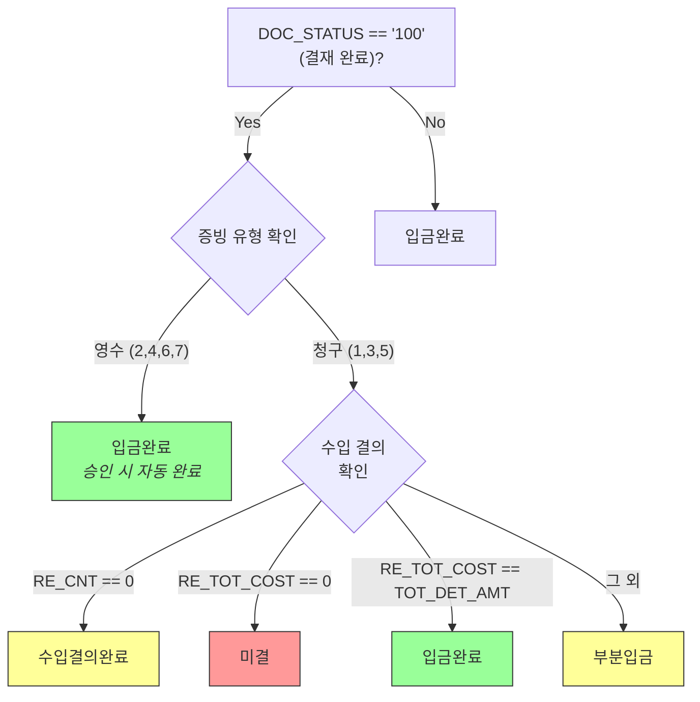

# 데이터 정합성 개선

## 회계 시스템에서 정합성의 의미

회계/정산 시스템에서 조회 합계와 엑셀 합계의 불일치는 회계 감사 지적 사항으로 이어질 수 있다. 부등호 한 글자(`>` vs `>=`), null guard 하나의 누락이 금액 오류로 직결되는 환경이다. 아래 4건의 사례를 근본 원인부터 추적하여 해결했다.

## 사례 1: 수입 결의서 조회/엑셀 불일치

| | Before | After |
|---|---|---|
| 조건 | `A.APP_DE > #{startDt}` | `A.APP_DE >= #{startDt}` |
| 영향 | 시작일 당일 결의서가 엑셀에서 누락 | 조회 결과와 엑셀 다운로드 일치 |

`payApp_SQL.xml`에서 부등호 1글자를 변경했다. UI 조회에서는 `>=`로 당일 데이터를 포함하지만 엑셀 다운로드 쿼리에서는 `>`로 당일을 제외하여, 동일 조건에서 화면 합계와 엑셀 합계가 달라지는 구조였다. 감사 시점에 발견되면 데이터 신뢰성 전체가 의심받는 문제이다.

## 사례 2: 개인 여비 전표 행 삭제 인덱스 불일치

| | Before | After |
|---|---|---|
| 행 ID | 전역 카운터 (`global.itemIndex++`) | 고유 ID (`timestamp + random`) |
| 행 삭제 후 | ID 충돌 → 잘못된 금액 매핑 | 정확한 데이터 수집 |

`regExnpPop.js` 대규모 리팩토링 (-1,604줄 / +1,697줄):
- 새로운 `collectPaymentData` 함수: 실제 행 ID 기반 데이터 수집
- Kendo 위젯 메모리 누수 방지를 위한 `delRow` 정리 로직 추가
- `safeUncommaN` 함수: undefined/null 값 안전 처리

전역 카운터 기반의 행 ID는 삭제 후 재할당 시 이전 행의 인덱스와 충돌하여 금액 데이터가 다른 행에 매핑되는 문제가 있었다. 타임스탬프 + 랜덤 값 조합의 고유 ID로 전환하여 행 삭제 후에도 데이터 매핑의 정확성을 보장한다.

## 사례 3: 입금 상태 매핑 오류

영수(Receipt)와 청구(Billing) 증빙 유형을 구분하지 않아 잔액 계산이 틀어지던 문제를 해결했다.

- 상수 정의: `RECEIPT_TYPES: ["2","4","6","7"]`, `BILLING_TYPES: ["1","3","5"]`
- 영수 유형: `PAY_EXNP_DE`(예정일), `TOT_DET_AMT`(명세 금액) 사용, 승인 시 자동 "입금완료"
- 청구 유형: `RE_APP_DE`(실입금일), `RE_TOT_COST`(실입금액) 기반 상태 산출
- SQL 측: `DJ_PAY_INCP_DET`에서 `EVID_TYPE` 서브쿼리 추가

## 사례 4: 카드 결제 undefined → DB 제약조건 위반

| | Before | After |
|---|---|---|
| JS 값 | `item.AUTH_NO` (null → `"undefined"`) | `(item.AUTH_NO \|\| '')` |
| DB 결과 | `"undefined"` 9자 → `varchar(2)` 초과 | 빈 문자열로 안전 저장 |

4개 필드(`AUTH_NO`, `AUTH_HH`, `AUTH_DD`, `BUY_STS`)에 null guard를 추가했다. JavaScript에서 null 값이 문자열 결합 시 `"undefined"`로 변환되어 DB 컬럼 길이 제약을 초과하는 문제였다.

## 패턴 분석

4건의 사례에는 공통된 근본 원인이 있다: **데이터 경계에서의 방어적 처리 부재**.

- **사례 1**: 쿼리 간 경계 — 동일 조건을 사용하는 두 쿼리(조회/엑셀)가 서로 다른 비교 연산자를 사용
- **사례 2**: UI-서버 경계 — 클라이언트 행 ID와 서버 데이터 매핑 간의 불일치
- **사례 3**: 도메인 경계 — 증빙 유형에 따라 다른 상태 산출 로직이 필요하나 단일 경로로 처리
- **사례 4**: 타입 경계 — JavaScript null이 문자열 컨텍스트에서 `"undefined"`로 변환되어 DB 제약 위반

각각은 단순한 버그이지만, 회계 시스템이라는 맥락에서 데이터 정합성에 직접적 영향을 미치는 문제였다. [SQL 최적화](./sql-optimization)에서 다룬 `BadSqlGrammarException` 비율 감소(27.1% → 3.01%)도 이러한 데이터 경계 처리 개선의 누적 효과이다.

### 관련 커밋

| 커밋 | 날짜 | 내용 |
|------|------|------|
| `b7c1232` | 2025-09-15 | 조회/엑셀 불일치 (날짜 부등호 수정) |
| `c6b4aa1` | 2025-07-16 | 행 삭제 인덱스 불일치 (대규모 리팩토링) |
| `29f7c33` | 2025-10-13 | 입금 상태 매핑 오류 수정 |
| `f897a5d` | 2025-09-09 | undefined → DB 제약조건 위반 해결 |
