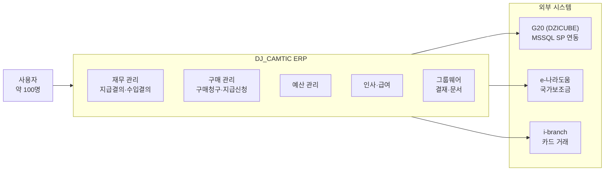

# DJ_CAMTIC ERP 안정화 — 프로젝트 개요

## 프로젝트 배경

DJ_CAMTIC은 eGovFramework 기반의 ERP/그룹웨어 시스템으로, 예산 관리·지급 결의·구매 청구·인사 관리 등 조직 전반의 업무를 처리한다. 외부 G20(DZICUBE), e-나라도움 및 카드 시스템(i-branch)과 연동되는 구조이다.

| 항목 | 내용 |
|------|------|
| 기간 | 2025.05 ~ 2025.10 (약 6개월) |
| 팀 규모 | 1명 (단독) |
| 사용자 수 | 약 100명 |
| 데이터 규모 | 489개 테이블, 일부 카디널리티 10억+ |
| 기술 스택 | eGovFramework 3.10.0 / Spring MVC 4.3.25 / MyBatis / MariaDB 10.4.32 / MSSQL 2008 |
| 빌드/배포 | Maven, Tomcat, GitLab CI/CD |
| 주요 도메인 | 재무, 구매, 예산, 결의, 외부 ERP 연동(G20), e-나라도움, 카드 연동(i-branch) |

## 시스템 컨텍스트

## 인수인계 시점 문제 진단

운영 과정에서 세 가지 범주의 구조적 문제가 확인되었다.

### 성능

- 구매 지급 신청 화면 응답 시간 10초 이상
- Full Table Scan 발생 (인덱스 전무)
- 다중 테이블 JOIN에 상관 서브쿼리 15개

### 운영 불안정

- 테스트 코드 부재
- 로그 구조 미비 (`catalina.out` 단일 파일 5GB+)
- Log Rotation 미구현
- Deadlock 발생

### 유지보수성 저하

- Map 파라미터 기반 설계
- 절차지향 코드
- 중복 로직 다수
- 문서 전무

## 개선 성과 요약

| 영역 | 핵심 지표 | 상세 |
|------|-----------|------|
| 성능 | 구매 지급 신청 조회 10초 → 2초 | [SQL 최적화](./sql-optimization) |
| 안정성 | 시간당 오류 5.0건 → 2.8건 (44% 감소) | [로깅/모니터링 체계](./logging-monitoring) |
| 데이터 | 회계 정합성 버그 4건 해결 | [데이터 정합성 개선](./data-integrity) |
| 운영 | CI/CD 파이프라인 구축, 원클릭 롤백 | [CI/CD 파이프라인](./cicd-pipeline) |
| 품질 | 테스트 도입, 3,831줄 문서 작성 | [코드 구조·테스트·문서화](./code-quality) |
| 측정 | 버전별 오류 추이 정량 비교 | [Streamlit 로그 대시보드](./log-dashboard) |

131건 커밋 (feat 12 / fix 77 / chore·docs 18 / 기타 24)

## 한계 및 회고

### 기여 범위 vs 환경 제약

| 구분 | 제어 가능 | 환경 제약 |
|------|-----------|-----------|
| 성능 | 복합 인덱스 14개 설계, 쿼리 구조 전환 | 489개 테이블 중 일부 카디널리티 10억+ (스키마 변경 불가) |
| 안정성 | Log4j2 로테이션, 예외 전파 패턴 전환 | MSSQL Stored Procedure 내부 트랜잭션 (G20 외부 시스템) |
| 운영 | CI/CD 파이프라인, Spring Profile 환경 분리 | eGovFramework 3.x 버전 고정 (업그레이드 불가) |
| 품질 | 테스트 도입 (JUnit + Jest), 문서 12건 | 레거시 Map 파라미터 구조 전면 전환은 리스크 과다 |

### 미해결 과제

- **Deadlock**: 외부 시스템(G20) 측 SP 내부 트랜잭션을 제어할 수 없는 구조적 한계로 완전 해결 불가
- **트랜잭션 경계**: 서비스 레이어의 트랜잭션 범위가 넓어 불필요한 락 경합 발생 — 경계 재설계 필요

### 핵심 교훈

- **점진적 개선이 현실적이다**: 전면 재작성(Big Rewrite)보다 병목 지점 중심의 점진적 개선이 리스크를 최소화하면서 실질적 성과를 가져왔다. 489개 테이블 전체가 아닌, 실제 사용자가 체감하는 핵심 화면의 쿼리부터 개선한 것이 유효한 판단이었다.
- **측정이 개선을 이끈다**: [로그 분석 도구](./log-dashboard)를 통해 "시간당 오류 5.0건 → 2.8건"이라는 정량적 근거를 확보한 것이 개선 방향을 검증하는 데 결정적이었다.
- **레거시에서의 선택은 트레이드오프다**: Map 파라미터 구조의 전면 전환은 리스크가 과도하여 의도적으로 보류하고, 그 시간을 인덱스 설계와 쿼리 최적화에 집중한 것이 더 큰 성과로 이어졌다.
