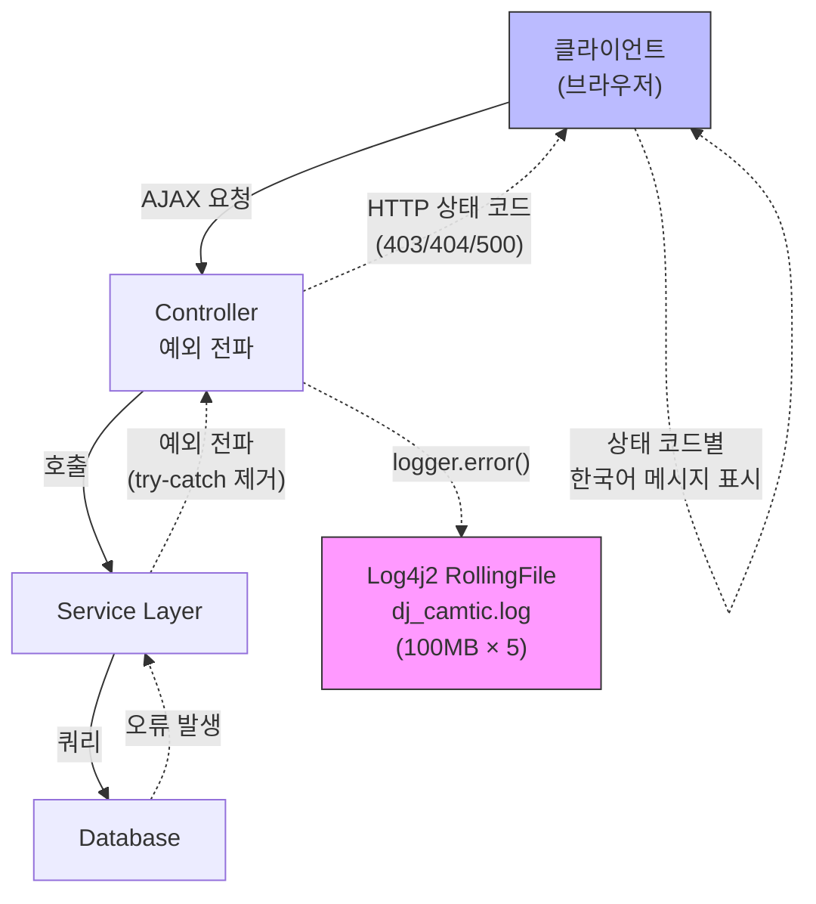

# 로깅/모니터링 체계

## 초기 상태

| 항목 | Before | After |
|------|--------|-------|
| 로그 저장 | Tomcat `catalina.out` 단일 파일, 5GB+ 누적. 주기적 수동 삭제 필요, 검색/분석 불가 | Log4j2 RollingFile (100MB × 5 로테이션, 최대 500MB). 타임스탬프·스레드·레벨 포함 구조적 포맷 |
| 예외 처리 | `try-catch` + `e.printStackTrace()` (20+ 메서드) | 커스텀 예외 계층 활용 구조적 예외 처리 |
| 클라이언트 응답 | 오류 시에도 항상 200 OK (무음 실패) | HTTP 상태 코드 기반 한국어 오류 메시지 |

## 설계 판단: ELK vs Log4j2

ELK 스택(Elasticsearch·Logstash·Kibana) 대신 Log4j2 RollingFile을 선택했다. 단독 운영 환경에서 ELK 인프라를 추가로 구축·유지하는 부담이 과도했다. 100명 규모에서는 파일 기반 로그 + [Streamlit 분석 도구](./log-dashboard) 조합이 충분했고, 인프라 복잡도를 최소화하는 것이 단독 운영자에게 더 현실적이었다.

## 에러 흐름 아키텍처



에러 흐름은 3계층 구조로 설계했다. 각 계층은 독립적으로 동작하며, 하위 계층의 오류가 상위로 전파되는 구조이다.

## Layer 1: 로그 영속화

Log4j2 설정에 RollingFile appender를 추가하여 서버 재시작 후에도 로그를 보존한다.

```xml
<RollingFile name="appFile"
             fileName="${sys:catalina.home}/logs/dj_camtic.log"
             filePattern="${sys:catalina.home}/logs/dj_camtic.%i.log">
    <PatternLayout pattern="%d{yyyy-MM-dd HH:mm:ss} [%t] %-5level %logger{36} - %msg%n"/>
    <Policies>
        <SizeBasedTriggeringPolicy size="100 MB"/>
    </Policies>
    <DefaultRolloverStrategy max="5"/>
</RollingFile>
```

모든 로거(`egovframework`, `java.sql`, `org.springframework`, Root)에 `appFile` appender를 연결하여 콘솔과 파일 동시 출력한다.

## Layer 2: 예외 전파 패턴 전환

`PayAppController.java`의 20+ 메서드에서 예외를 삼키는 패턴을 제거하고, 커스텀 예외 계층(`NotFoundLoginSessionException`, `BudgetAmtOverException` 등 14종)을 활용한 구조적 예외 처리로 전환했다.

14종 커스텀 예외를 설계한 이유: `@ControllerAdvice` 단일 핸들러로 모든 예외를 처리할 수도 있지만, 예산초과·세션만료·ERP연동 오류는 각각 다른 사용자 액션(재입력/재로그인/관리자 문의)을 요구하므로 도메인별 분기가 필요했다.

```java
// BEFORE — 예외가 삼켜지고, 항상 성공 응답
try {
    payAppService.setExnpData(params, fileList, SERVER_DIR, BASE_DIR);
    model.addAttribute("code", 200);
} catch (Exception e) {
    e.printStackTrace();  // 콘솔에만 출력, 클라이언트는 모름
}

// AFTER — 예외 전파 (커스텀 예외 활용)
payAppService.setExnpData(params, fileList, SERVER_DIR, BASE_DIR);
model.addAttribute("code", 200);
```

최종 리팩토링에서 204줄 삭제 / 59줄 추가 — `try-catch` 블록을 일괄 제거하고 예외 전파 구조로 전환했다.

## Layer 3: 클라이언트 에러 피드백

AJAX 요청의 `error` 콜백에서 HTTP 상태 코드별 한국어 메시지를 표시한다.

```javascript
error: function (xhr, status, error) {
    var errorMessage = "데이터 저장 중 오류가 발생했습니다.\n\n";
    if (xhr.status === 0)   errorMessage += "네트워크 연결을 확인해주세요.";
    if (xhr.status === 403) errorMessage += "권한이 없습니다.";
    if (xhr.status === 404) errorMessage += "요청한 페이지를 찾을 수 없습니다.";
    if (xhr.status === 500) errorMessage += "서버 오류가 발생했습니다.";
    alert(errorMessage);
}
```

기존에는 오류 시에도 HTTP 200을 반환하여 클라이언트가 실패를 인지하지 못하는 무음 실패(Silent Failure) 상태였다. HTTP 상태 코드 기반 응답으로 전환하여 사용자에게 오류 상황과 대응 방법을 전달한다.

## 성과

- 시간당 오류: **5.0건 → 2.8건 (44% 감소)**
- 오류 유형 수: 31종 → 22종 (-29%)
- 영향 파일 수: 64개 → 39개 (-39%)

이 지표는 [Streamlit 로그 대시보드](./log-dashboard)에서 측정한 결과이다.

### 관련 커밋

| 커밋 | 날짜 | 내용 |
|------|------|------|
| `eb7c5a6` | 2025-09-09 | RollingFile appender 추가 |
| `850a664` | 2025-07-17 | 오류 시 HTTP 상태 코드 응답 |
| `f34e825` | 2025-07-17 | 상태 코드별 클라이언트 UI |
| `d1b161f` | 2025-08-21 | 오류 로그 노출 (예외 전파 시작) |
| `0cf36e9` | 2025-09-09 | 오류 로그 노출 확대 |
| `3de0694` | 2025-10-31 | 오류 로그 가시화 (최종 리팩토링, -204/+59줄) |
