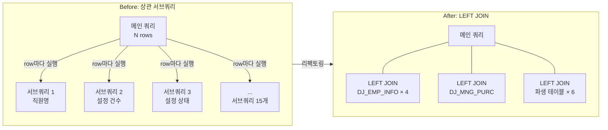

# SQL 최적화

## 문제 상황

구매 지급 신청 조회 화면의 응답 시간이 10초를 초과했다. 원인은 인덱스 전무로 인한 Full Table Scan과, SELECT 절에 포함된 15개의 상관 서브쿼리(Correlated Subquery)였다. 각 서브쿼리는 메인 쿼리의 모든 행에 대해 반복 실행되는 구조로, 행 수에 비례하여 성능이 저하되었다.

## 접근 전략

병목 쿼리의 실행 계획(EXPLAIN) 분석 → 복합 인덱스 설계 → 쿼리 구조 전환의 3단계로 접근했다. Full Table Scan을 Index Range Scan으로 전환하고, 상관 서브쿼리를 LEFT JOIN + 파생 테이블로 대체하여 10초 → 약 2초를 달성했다.

Materialized View 대신 JOIN 전환을 선택한 근거: MariaDB 10.4는 MV를 지원하지 않고, eGovFramework의 MyBatis 동적 SQL 특성상 쿼리 캐시의 효과도 제한적이다. 쿼리 구조 자체를 개선하는 접근이 가장 현실적이었다.

## 인덱스 설계 원칙

- **등치 조건(=) 컬럼을 선두에 배치** → 인덱스 프리픽스 매칭 활용
- **범위/정렬 컬럼은 등치 컬럼 뒤에 배치** → ORDER BY/BETWEEN 최적화
- **커버링 인덱스로 테이블 룩업 제거** → 디스크 I/O 감소
- **FK 컬럼 인덱싱으로 JOIN 성능 확보** → Nested Loop Join 최적화

4개 스키마(`cam_mng`, `inside`, `cam_pjt_mng`, `dj_camtic`)에 걸쳐 커스텀 인덱스를 설계했다. `cam_mng` 스키마만 14개 커스텀 인덱스(단일 컬럼 7개 + 복합 7개)를 적용했다.

## 인덱스 설계 사례

### (a) 구매 요청 조회 — `dj_mng_purc(STATUS, DOC_STATUS, REG_DATE)`

- `STATUS`, `DOC_STATUS`는 등치 조건(=)으로 빈번하게 필터링되는 컬럼 → 선두 배치로 후보 행 즉시 축소
- `REG_DATE`는 날짜 범위 조건에 활용 → 후미 배치로 범위 스캔 최적화
- **결과**: Full Table Scan → 복합 인덱스 Range Scan

### (b) 지출결의 완료 조회 — `dj_exnp(PAY_APP_SN, REQ_END_DE)`

쿼리 (EDOC 파생 테이블):

```sql
LEFT JOIN (
    SELECT Y.PAY_APP_SN, COUNT(*) AS EXNP_DOC_STATUS
    FROM CAM_MNG.DJ_EXNP_DET X
    JOIN CAM_MNG.DJ_EXNP Y ON X.EXNP_SN = Y.EXNP_SN
    WHERE Y.REQ_END_DE IS NOT NULL AND Y.REQ_END_DE <> ''
    GROUP BY Y.PAY_APP_SN
) EDOC ON A.PAY_APP_SN = EDOC.PAY_APP_SN
```

- `PAY_APP_SN`은 JOIN + GROUP BY 키 → 선두 배치로 그룹별 정렬 불필요
- `REQ_END_DE`는 IS NOT NULL 필터 → 후미 배치로 인덱스 내에서 필터링
- **결과**: 파생 테이블 집계 시 테이블 풀 스캔 → 인덱스 스캔으로 전환

### (c) 카드 거래 매칭 — `dj_card_to_hist(AUTH_NO, AUTH_DD, AUTH_HH, CARD_NO)`

```sql
LEFT JOIN CAM_MNG.DJ_CARD_TO_HIST D
  ON A.AUTH_NO = D.AUTH_NO
 AND A.AUTH_DD = D.AUTH_DD
 AND A.AUTH_HH = D.AUTH_HH
 AND A.CARD_NO = REPLACE(D.CARD_NO, "-", "")
```

- `AUTH_NO`, `AUTH_DD`, `AUTH_HH`는 등치 조건(=) → 복합 인덱스 선두 3컬럼으로 후보 행 대폭 축소
- `CARD_NO`는 `REPLACE()` 함수 적용으로 인덱스 직접 탐색 불가 → 인덱스 필터링 후 행 단위 비교로 처리
- 동일 구조의 인덱스를 `dj_use_card_info`에도 적용 → 두 테이블 동시 JOIN 최적화

## 사례: 상관 서브쿼리 → LEFT JOIN 전환

`purc.xml`에서 15개의 상관 서브쿼리를 LEFT JOIN + 사전 집계 파생 테이블로 전환했다 (+121/−74줄). 인덱스 설계와 결합하여 10초 → 2초 개선의 핵심이 되었다.



### Before — SELECT 절의 상관 서브쿼리들

```sql
-- 직원명 (4회 반복, 각각 다른 키로 참조)
(SELECT EMP_NAME_KR FROM CAM_HR.DJ_EMP_INFO WHERE A.EMP_SEQ = EMP_SEQ) AS F_EMP_NAME,
-- 금액 집계 (개별 서브쿼리 × 3)
(SELECT SUM(REQ_AMT) FROM CAM_MNG.DJ_CLAIM_EXNP WHERE CE_GW_IDX = A.CE_GW_IDX) AS REQ_AMT,
-- 등록자명 (중첩 서브쿼리 — 2단계 조회)
(SELECT EMP_NAME_KR FROM CAM_HR.DJ_EMP_INFO
 WHERE EMP_SEQ = (SELECT REG_EMP_SEQ FROM CAM_MNG.DJ_MNG_PURC WHERE ...)) AS REG_EMP_NAME,
-- ... 총 15개
```

### After — LEFT JOIN + 파생 테이블

```sql
-- 직원 정보: 역할별 4회 JOIN (담당자/지급자/확인자/등록자)
LEFT JOIN CAM_HR.DJ_EMP_INFO FEMP ON FEMP.EMP_SEQ = A.EMP_SEQ
LEFT JOIN CAM_HR.DJ_EMP_INFO PEMP ON PEMP.EMP_SEQ = A.PAY_EMP_SEQ
LEFT JOIN CAM_MNG.DJ_MNG_PURC MP ON MP.PURC_SN = B.PURC_SN
LEFT JOIN CAM_HR.DJ_EMP_INFO REMP ON REMP.EMP_SEQ = MP.REG_EMP_SEQ  -- 2단계 JOIN

-- 파생 테이블: 사전 집계로 row별 반복 제거 (총 6개)
LEFT JOIN (
    SELECT CE_GW_IDX, SUM(REQ_AMT) AS REQ_AMT, COUNT(REQ_AMT) AS REQ_CNT,
           SUM(EXNP_AMT) AS EXNP_AMT
    FROM CAM_MNG.DJ_CLAIM_EXNP GROUP BY CE_GW_IDX
) EXAGG ON EXAGG.CE_GW_IDX = A.CE_GW_IDX
-- ...
```

### 파생 테이블 역할 정리

| 별칭 | 원본 테이블 | 역할 |
|------|-------------|------|
| `PDT` | `DJ_PAY_APP_DET` | 결제상세 집계 (금액합계, 거래처명, 품목 수) |
| `EXAGG` | `DJ_CLAIM_EXNP` | 청구 지출 집계 (요청/지출 금액, 건수) |
| `CS` | `DJ_CLAIM_SETTING` | 청구건별 세팅 상태 집계 |
| `PS` | `DJ_PAY_APP_DET` | 증빙저장 여부 카운트 |
| `EDOC` | `DJ_EXNP_DET` + `DJ_EXNP` | 지출결의 문서완료 카운트 |
| `LEX` | `DJ_EXNP` | 최신 반제 상태 (`MAX EXNP_SN`) |

WHERE 절의 `CASE WHEN` 조건을 `AND/OR` 조건으로 단순화하고, 중첩 서브쿼리를 2단계 LEFT JOIN으로 평탄화했다.

## 사례: REGEXP → LIKE 전환

`payApp_SQL.xml` 내 12건의 `REGEXP`를 LIKE 패턴으로 일괄 전환했다. 사용자 입력이 정규식으로 해석되는 구조는 보안(ReDoS)과 안정성 양면에서 리스크가 있다.

| | Before | After |
|---|---|---|
| 검색 | `REGEXP #{searchValue}` | `LIKE CONCAT('%', #{searchValue}, '%')` |
| 특수문자 | `\`, `(`, `*` 입력 시 SQL 오류 | 모든 문자 안전 검색 |
| 보안 | ReDoS 공격 가능성 | 파라미터화된 LIKE로 안전 |

## 사례: SQL Server NVARCHAR 구문 오류

MySQL(주 DB)과 MSSQL(G20 연동)을 동시에 사용하는 환경에서 크로스 DB 호환성 문제가 발생했다. MyBatis XML 파싱 시 `DECLARE` 문의 변수 선언이 여러 줄로 분리되어 구문 오류가 발생했다.

```sql
-- BEFORE (XML 파싱에 의해 깨진 구문)
DECLARE
@
CO_CD
NVARCHAR
    (4)

-- AFTER (정상 구문)
DECLARE @CO_CD NVARCHAR(4),
        @DATE NVARCHAR(8),
        @FR_DT NVARCHAR(8),
        @TO_DT NVARCHAR(8)
```

`g20_SQL.xml`의 `getCommonGisuInfo` 쿼리 전체를 SQL Server 표준 구문에 맞게 재정리했다.

## 사례: 불필요한 CDATA 삭제

`CDATA` 래핑이 MyBatis `<if>` 태그 해석을 차단하여 조건부 쿼리가 작동하지 않던 문제를 해결했다.

```xml
<!-- BEFORE — CDATA 내부의 <if> 태그가 리터럴 텍스트로 처리됨 -->
<select id="getIncpBudgetList">
    <![CDATA[
    SELECT ... WHERE ...
    <if test="pjtCd != null"> AND A.PJT_CD = #{pjtCd} </if>
    ]]>
</select>

<!-- AFTER — MyBatis 동적 SQL 정상 작동 -->
<select id="getIncpBudgetList">
    SELECT ... WHERE ...
    <if test="pjtCd != null"> AND A.PJT_CD = #{pjtCd} </if>
</select>
```

## 결과

- 구매 지급 신청 조회: **10초 → 2초**
- `BadSqlGrammarException` 비율: **27.1% → 3.01%** — REGEXP 전환과 구문 오류 수정의 직접적 효과

### 관련 커밋

| 커밋 | 날짜 | 내용 |
|------|------|------|
| `4595607` | 2025-10-29 | 상관 서브쿼리 15개 → JOIN 전환 |
| `5b76afe` | 2025-08-12 | REGEXP → LIKE (특수문자 안전 검색) |
| `f81847f` | 2025-08-11 | MSSQL NVARCHAR 구문 오류 수정 |
| `e6be2c1` | 2025-09-04 | 불필요한 CDATA 삭제 |
