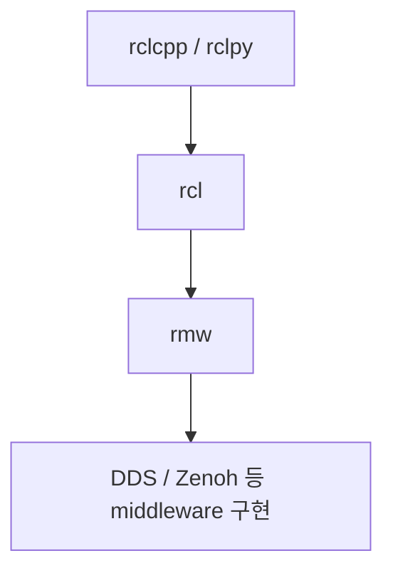
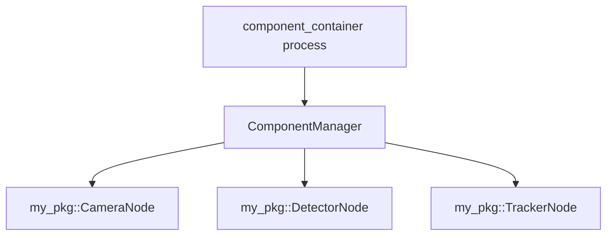
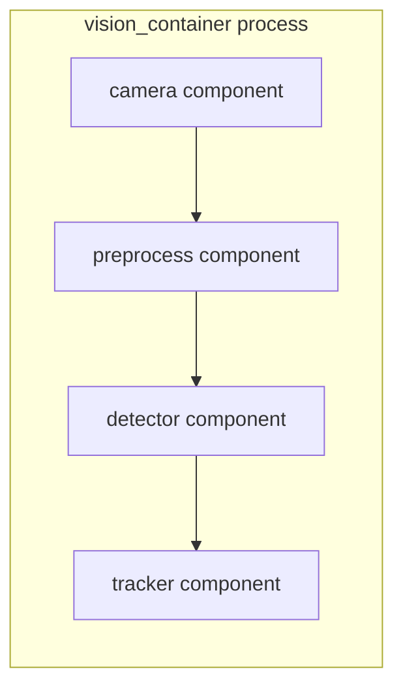
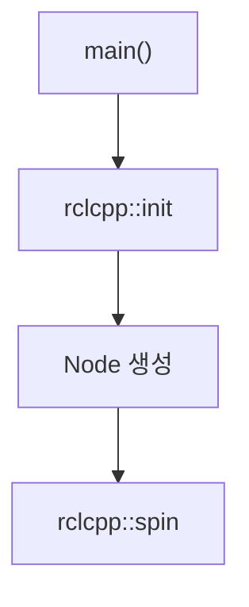
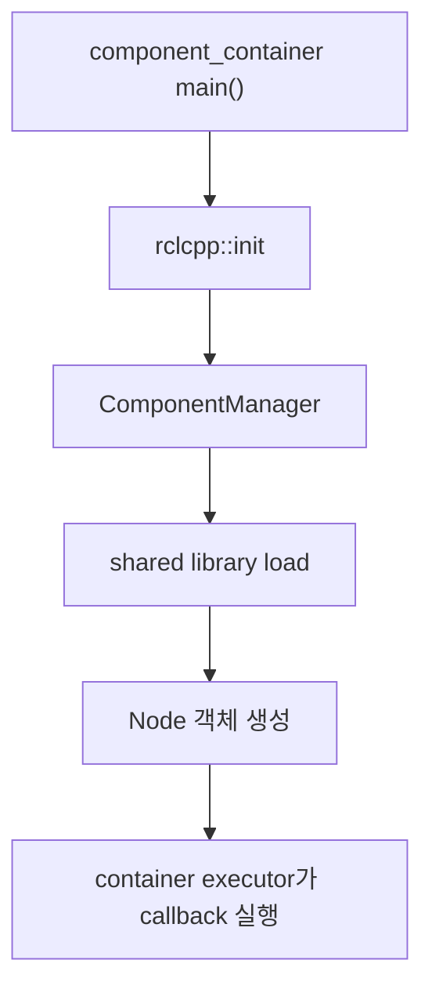
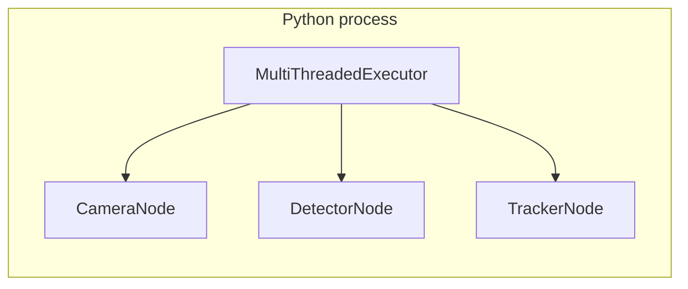
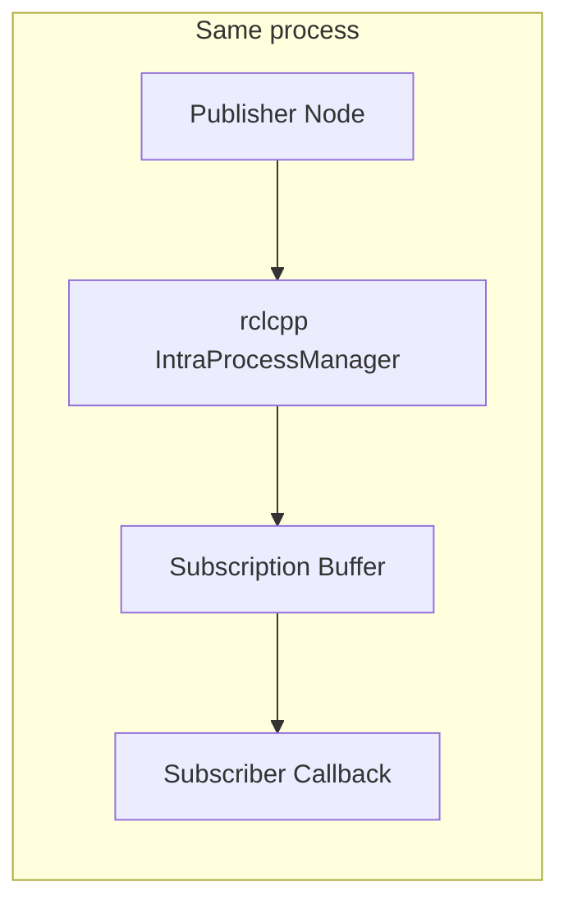
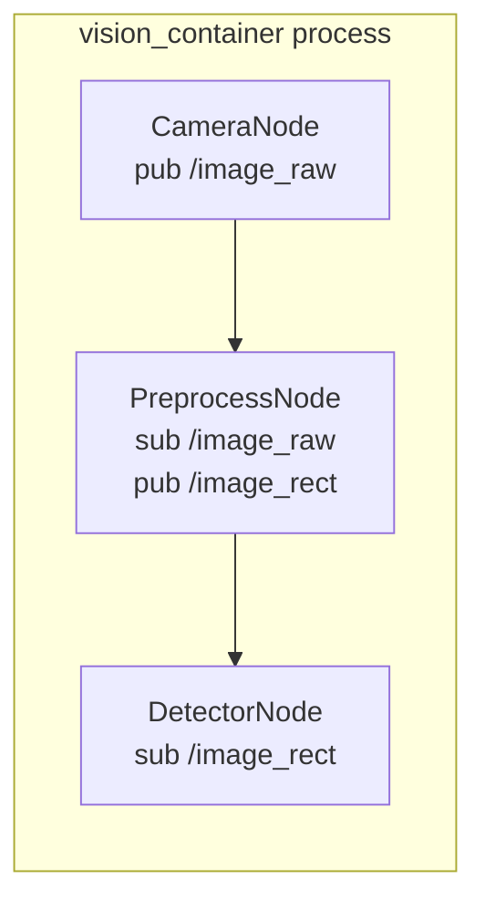
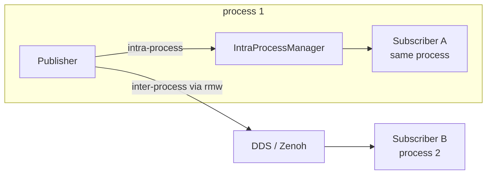
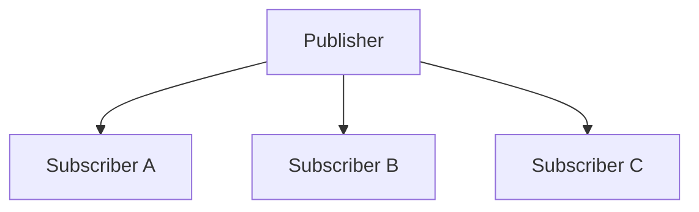

# ROS 2 Composition과 실행 단위의 분리

ROS 2에서 `ros2 run` 명령은 node 하나당 process 하나를 띄웁니다. 다만 이 1:1 관계는 강제되는 것이 아니라 기본 실행 형태일 뿐입니다. ROS 2는 node와 process를 분리된 단위로 설계했고, 이 분리를 활용해야 의미가 생기는 기능들이 있습니다.

이 문서는 다음 흐름으로 정리합니다.

- node, process, executor, RMW 같은 실행 구조의 기본 용어
- Composition이 무엇을 해결하는 기능인지
- Composable Node가 왜 C++ shared library 형태로 만들어지는지
- Python 사용자는 이 모델을 어디까지 받아들여야 하는지
- 같은 process 안의 topic 통신이 inter-process 통신과 어떻게 다른지
- 언제 Composition을 쓰고, 언제 별도 process를 유지해야 하는지

## 1. 핵심 용어

### 1.1 Node

ROS 2에서 node는 **기능 단위**입니다. 카메라를 읽는 기능, 이미지를 전처리하는 기능, 객체를 검출하는 기능을 각각 별개의 node로 만듭니다.

Python에서는 보통 다음처럼 작성합니다.

```python
import rclpy
from rclpy.node import Node

class CameraNode(Node):
    def __init__(self):
        super().__init__('camera')
```

C++에서는 다음과 같습니다.

```cpp
class CameraNode : public rclcpp::Node
{
public:
  CameraNode() : rclcpp::Node("camera") {}
};
```

여기서 중요한 점은 node가 OS 수준의 실행 단위가 아니라는 것입니다. node는 코드 레벨의 기능 묶음이고, 실제로 OS가 실행하는 단위는 process입니다.

### 1.2 Process

Process는 OS에서 실행되는 프로그램 단위입니다. 다음 명령은 하나의 process를 띄웁니다.

```bash
ros2 run my_pkg camera
```

흔히 다음 등식이 전제되곤 합니다.

```
node 1개 = process 1개
```

ROS 2에서는 이 등식이 강제되지 않습니다. 하나의 process 안에 여러 node를 둘 수도 있고, 이 구조가 Composition으로 이어집니다.

### 1.3 Executor

Executor는 node에 등록된 callback을 실제로 실행하는 주체입니다. timer callback, subscription callback, service callback, action callback이 모두 executor를 통해 실행됩니다.

가장 흔한 형태는 다음 한 줄입니다.

```python
rclpy.spin(node)
```

하나의 process 안에서 여러 node를 함께 spin하려면 executor에 직접 추가합니다.

```python
from rclpy.executors import MultiThreadedExecutor

executor = MultiThreadedExecutor()
executor.add_node(camera)
executor.add_node(detector)
executor.spin()
```

한 가지 짚어둘 점이 있습니다. **executor는 callback을 실행하는 스케줄러일 뿐, topic 메시지의 전달 경로 그 자체는 아닙니다.** 같은 executor에 여러 node를 추가했다고 해서 topic 통신이 자동으로 zero-copy가 되는 것은 아닙니다.

### 1.4 RMW

RMW(ROS Middleware Interface)는 ROS 2 client library와 실제 middleware 구현 사이의 추상화 계층입니다.



ROS 2 코드는 직접 DDS를 호출하지 않고 RMW를 거칩니다. 일반적인 process 간 topic 통신은 RMW 아래의 middleware 구현을 통해 전달됩니다.

### 1.5 Component

Component는 **container에 로드 가능한 형태로 만들어진 C++ node 구현체**입니다.

일반 C++ node는 자신이 직접 실행됩니다. 자기 자신이 process의 entrypoint(`main()`)를 가집니다.

```
my_node executable
- main()
- rclcpp::spin()
- MyNode
```

Composable C++ node는 자기 자신이 실행되지 않습니다. 대신 다음 형태로 빌드됩니다.

```
libmy_node_component.so
- MyNode 클래스
- RCLCPP_COMPONENTS_REGISTER_NODE 매크로로 등록된 plugin 정보
```

이 shared library를 별도의 host process가 동적으로 로드해서 node 객체를 만듭니다. 그 host process가 component container입니다.

### 1.6 Component Container

Component container는 component들을 담는 host process입니다. 다음처럼 띄워둡니다.

```bash
ros2 run rclcpp_components component_container
```

그다음 component를 로드합니다.

```bash
ros2 component load /ComponentManager my_pkg my_pkg::CameraNode
```

구조는 다음과 같습니다.



여기까지 정리하면, ROS 2의 실행 구조는 "node = 기능 단위", "process = OS 실행 단위", "executor = callback 스케줄러", "RMW = middleware 추상화", "component / container = node를 process에 동적으로 배치하기 위한 도구"로 분해됩니다. Composition은 이 분리를 실제로 활용하는 기능입니다.

## 2. Composition이란

Composition은 **여러 ROS 2 node를 하나의 process 안에 배치하는 방식**입니다. node 코드를 줄이는 기법이 아니라, 코드 상의 node 구조와 실행 시점의 process 구조를 분리하는 기능입니다.

### 2.1 일반 실행 방식

각 node가 별도 process로 실행되는 구조입니다.


장점은 단순함입니다. 디버깅이 쉽고, 로그와 crash가 process 단위로 분리되며, 한 node가 죽어도 다른 process는 살아 있습니다. 개발 초기에 이해하기도 쉽습니다.

단점은 process 수가 많아진다는 점, 그리고 대용량 topic이 process boundary를 반복해서 넘는다는 점입니다. 이미지나 PointCloud처럼 큰 메시지가 4단계 pipeline을 거치면 serialize / copy / deserialize가 매 단계마다 발생합니다.

### 2.2 Composition 방식

여러 node를 하나의 container process 안에 배치하는 구조입니다.



장점은 process 수를 줄일 수 있다는 점, 같은 process 내부 통신 최적화(intra-process communication)를 사용할 수 있다는 점, 그리고 코드 구조와 실행 배치를 분리할 수 있다는 점입니다. 같은 코드를 개발 단계에서는 별도 process로, 운영 단계에서는 container로 묶어 실행할 수 있습니다.

단점은 component 하나의 segmentation fault가 container 전체를 죽일 수 있다는 점, 디버깅이 까다로워진다는 점, 그리고 executor / thread / callback group 설계 부담이 늘어난다는 점입니다.

정리하면 Composition의 정확한 의미는 다음과 같습니다.

> node는 기능별로 계속 나누되, 실행 시점에는 여러 node를 하나의 process 안에 배치할 수 있게 해주는 기능.

## 3. Composable Node

Composable Node는 container에 로드되어 실행될 수 있도록 작성된 node입니다. C++ 기준으로 일반 node와는 몇 가지 차이가 있습니다.

- `main()`이 없습니다
- `rclcpp::Node`를 상속하는 것은 동일합니다
- constructor가 `rclcpp::NodeOptions`를 받습니다
- `RCLCPP_COMPONENTS_REGISTER_NODE` 매크로로 plugin 등록을 합니다
- CMake에서 executable이 아니라 `add_library(... SHARED ...)`로 빌드합니다

### 3.1 일반 C++ node

```cpp
class CameraDriver : public rclcpp::Node
{
public:
  CameraDriver() : rclcpp::Node("camera_driver") {}
};

int main(int argc, char * argv[])
{
  rclcpp::init(argc, argv);
  rclcpp::spin(std::make_shared<CameraDriver>());
  rclcpp::shutdown();
  return 0;
}
```

CMake는 다음과 같습니다.

```cmake
add_executable(camera_driver src/camera_driver.cpp)
```

실행은 직접 합니다.

```bash
ros2 run my_pkg camera_driver
```

### 3.2 Composable C++ node

`main()`을 제거하고 constructor 시그니처를 바꿉니다.

```cpp
class CameraDriver : public rclcpp::Node
{
public:
  explicit CameraDriver(const rclcpp::NodeOptions & options)
  : rclcpp::Node("camera_driver", options)
  {
  }
};
```

Component 등록 매크로를 추가합니다.

```cpp
#include <rclcpp_components/register_node_macro.hpp>
RCLCPP_COMPONENTS_REGISTER_NODE(CameraDriver)
```

CMake에서는 shared library로 빌드합니다.

```cmake
add_library(camera_driver_component SHARED src/camera_driver.cpp)

rclcpp_components_register_node(
  camera_driver_component
  PLUGIN "CameraDriver"
  EXECUTABLE camera_driver
)
```

### 3.3 `main()`이 사라지는 이유

일반 node는 자기 자신이 process의 entrypoint를 갖습니다.



Composable Node는 직접 실행되지 않습니다. Process의 entrypoint는 container가 갖고, container가 shared library를 로드한 뒤 node 객체를 만듭니다.



따라서 component 자체에는 `main()`이 있어서는 안 됩니다.

### 3.4 `NodeOptions`를 받는 이유

Container는 같은 component를 다양한 이름, namespace, parameter, remapping 조합으로 띄울 수 있어야 합니다. 이런 설정은 component를 로드하는 시점에 결정됩니다. 그래서 component constructor는 자기 이름이나 옵션을 직접 결정하지 않고, container가 넘기는 `NodeOptions`를 받습니다.

```cpp
explicit CameraDriver(const rclcpp::NodeOptions & options)
: rclcpp::Node("camera_driver", options)
{
}
```

`NodeOptions`에는 node name, namespace, remapping, parameters, `use_intra_process_comms`, ROS arguments 등이 담깁니다. 같은 shared library가 container 안에서 여러 인스턴스로 다르게 동작할 수 있는 이유입니다.

## 4. Python 사용자 관점

지금까지의 설명은 C++ `rclcpp_components` 중심입니다. Python을 주로 쓰는 입장에서는 이 모델을 어디까지 받아들여야 하는지 정리할 필요가 있습니다.

### 4.1 Python node도 정상적인 ROS 2 node입니다

Python에서는 `rclpy`로 node를 작성합니다.

```python
import rclpy
from rclpy.node import Node

class Talker(Node):
    def __init__(self):
        super().__init__('talker')
```

실행은 일반적으로 다음과 같습니다.

```bash
ros2 run my_py_pkg talker
```

Launch에서는 `launch_ros.actions.Node`를 사용합니다.

```python
from launch import LaunchDescription
from launch_ros.actions import Node

def generate_launch_description():
    return LaunchDescription([
        Node(
            package='my_py_pkg',
            executable='talker',
            name='talker',
            output='screen',
        ),
    ])
```

### 4.2 `component_container`와의 관계

공식 Composition 문서에 등장하는 `component_container`, `RCLCPP_COMPONENTS_REGISTER_NODE`, `rclcpp_components_register_node`는 모두 C++ `rclcpp_components` 기반입니다. Python node를 일반적인 `component_container`에 다음처럼 로드하지는 않습니다.

```bash
ros2 component load /ComponentManager my_py_pkg my_py_pkg::MyPythonNode
```

Python node는 `ros2 run`이나 launch file의 `Node` 액션으로 실행하는 것이 표준입니다.

### 4.3 한 process에 여러 Python node 띄우기

Python에서도 하나의 process 안에 여러 node를 둘 수 있습니다. 직접 executor를 만들어 node를 추가하면 됩니다.

```python
import rclpy
from rclpy.executors import MultiThreadedExecutor

def main(args=None):
    rclpy.init(args=args)
    camera = CameraNode()
    detector = DetectorNode()
    tracker = TrackerNode()

    executor = MultiThreadedExecutor(num_threads=4)
    executor.add_node(camera)
    executor.add_node(detector)
    executor.add_node(tracker)

    try:
        executor.spin()
    finally:
        executor.shutdown()
        camera.destroy_node()
        detector.destroy_node()
        tracker.destroy_node()
        rclpy.shutdown()
```

구조는 다음과 같습니다.



이 구조는 C++ Composition과 동일하지 않습니다. 차이는 다음 표로 정리합니다.

| 항목 | C++ Composable Node | Python multi-node process |
|------|---------------------|---------------------------|
| 등록 방식 | `RCLCPP_COMPONENTS_REGISTER_NODE` | 없음 |
| 산출물 | shared library `.so` | Python module |
| container load / unload | 가능 | 일반적으로 불가 |
| intra-process 최적화 | C++ `rclcpp` 중심 | 동일하게 보면 안 됨 |
| 사용 방식 | `ComposableNodeContainer` | 직접 executor 구성 |

Python으로 한 process에 여러 node를 띄우는 것은 가능하지만, 그것이 "Python에서도 Composition을 쓰고 있다"는 뜻은 아닙니다. 실행 단위만 묶었을 뿐, C++ component 모델의 동적 load / unload나 intra-process 최적화 경로가 자동으로 따라오지는 않습니다.

## 5. 같은 process 안의 topic 통신

여기서 자연스럽게 이어지는 질문이 있습니다. 같은 process 안에 publisher node와 subscriber node가 있으면, 메시지는 RMW와 DDS를 거치지 않고 바로 전달될까요. shared memory를 쓰는 걸까요. 답은 조건부입니다.

### 5.1 먼저 구분해야 할 개념

다음 항목은 서로 같은 의미가 아닙니다.

- 같은 process에 있다
- 같은 executor에 있다
- 같은 context에 있다
- intra-process communication이 켜져 있다
- zero-copy가 된다
- RMW를 거치지 않는다
- shared memory를 쓴다

`rclcpp` intra-process 경로가 동작하기 위한 일반적인 조건은 다음에 가깝습니다.

- 같은 process
- 같은 `rclcpp` Context
- publisher / subscriber의 topic 이름과 QoS 호환
- `use_intra_process_comms = true`
- 주로 C++ `rclcpp` 기준

### 5.2 inter-process 경로

별도 process 간 topic 통신은 RMW 아래의 middleware를 통해 전달됩니다.


Process boundary를 넘기 때문에 대용량 메시지에서는 다음 비용이 누적됩니다.

- serialization
- 데이터 copy
- middleware transport
- deserialization
- callback scheduling

### 5.3 intra-process 경로

같은 process 안에 있고 `use_intra_process_comms`가 켜져 있으면, C++ `rclcpp`는 inter-process 경로 대신 intra-process 경로를 선택할 수 있습니다.



**이 경로는 OS shared memory segment를 쓰는 것이 아닙니다.** 같은 process 주소 공간 안에서 C++ message 객체를 그대로 전달하는 최적화입니다.

OS shared memory 모델이라면 publisher가 있는 process A와 subscriber가 있는 process B가 별도로 존재하고, 두 process가 공유하는 segment를 매개로 메시지가 오갑니다.


`rclcpp` intra-process는 이 구조가 아닙니다. 위 §5.3 그림처럼 publisher, message 객체, `IntraProcessManager`, subscription buffer, subscriber callback이 모두 하나의 process 주소 공간 안에 있고, message 객체가 그 안에서 publisher에서 subscription buffer로 이동합니다.

### 5.4 publisher가 publish하면 일어나는 일

같은 process 안에 다음 node들이 있다고 합시다.



`CameraNode`가 `/image_raw`를 publish하면 대략 다음 흐름이 가능합니다.

1. `CameraNode`의 publisher가 `publish(msg)`를 호출합니다
2. `rclcpp` publisher는 intra-process 통신이 켜져 있는지 확인합니다
3. 같은 process / context 안에서 topic 이름과 QoS가 호환되는 subscription을 찾습니다
4. 해당 subscription의 intra-process buffer에 메시지를 넣습니다
5. executor가 subscription callback을 실행합니다
6. 다른 process에 subscriber가 있다면, 별도로 RMW / DDS / Zenoh 경로로도 publish합니다

publisher 하나에서 두 경로가 동시에 존재할 수 있다는 점이 중요합니다.



같은 process 안의 subscriber에게는 intra-process 경로로 가지만, 다른 process의 subscriber에게는 여전히 RMW 경로로 나갑니다.

### 5.5 `unique_ptr`와 zero-copy

C++ intra-process 통신에서 메시지를 `std::unique_ptr`로 publish하면 copy를 줄일 수 있습니다.

```cpp
auto msg = std::make_unique<sensor_msgs::msg::Image>();
publisher_->publish(std::move(msg));
```

Subscriber callback도 unique pointer로 받을 수 있습니다.

```cpp
void on_image(sensor_msgs::msg::Image::UniquePtr msg)
{
  // msg 사용
}
```

수신자가 하나라면 메시지 객체의 소유권이 publisher에서 subscriber로 그대로 이동합니다. serialize / deserialize도 없고, 추가 copy도 없습니다.

다만 항상 zero-copy인 것은 아닙니다. subscriber가 여러 개라면 `unique_ptr` 하나를 모든 subscriber에게 동시에 move할 수 없습니다.



이 경우 callback 시그니처와 subscription buffer 정책에 따라 copy 또는 shared ownership이 사용될 수 있습니다.

정리하면 다음과 같습니다.

- intra-process는 copy를 **줄일 수 있는** 경로다
- intra-process가 **곧 zero-copy인 것은 아니다**

## 6. RMW · DDS · shared memory · intra-process 비교

지금까지 등장한 통신 관련 개념을 한 번에 정리합니다. 비슷해 보이지만 층위가 다릅니다.

| 개념 | 범위 | process boundary | 설명 |
|------|------|------------------|------|
| 일반 DDS / RMW 통신 | ROS 2 middleware | 넘을 수 있음 | 기본 topic 통신 경로. RMW를 거쳐 DDS / Zenoh로 나간다 |
| DDS shared memory transport | middleware 최적화 | 넘음 | DDS 구현 일부가 제공. process 간 통신을 OS shared memory로 최적화한다 |
| `rclcpp` intra-process communication | C++ client library 최적화 | 넘지 않음 | 같은 process 안에서 message 객체를 subscription buffer로 전달 |
| Python executor에 여러 node 추가 | Python 실행 구조 | 넘지 않음 | 실행 단위만 같은 process. C++ intra-process 최적화와 동일하게 보면 안 됨 |

특히 DDS shared memory transport와 `rclcpp` intra-process는 자주 혼동되지만 층위가 다릅니다. DDS shared memory는 여전히 middleware 위의 경로이고, `rclcpp` intra-process는 middleware를 거치지 않는 client library 내부 최적화입니다.

## 7. Composition의 장점과 단점

### 7.1 장점

**대용량 topic 처리 최적화.** 이미지나 PointCloud처럼 큰 메시지를 여러 node가 연쇄적으로 처리하면 process 간 통신 비용이 누적됩니다. 같은 container 안에 두면 intra-process 경로로 이 비용을 줄일 수 있습니다.

**node 구조와 process 구조의 분리.** 코드는 기능별 node로 나누고, 실행 배치는 상황에 따라 바꿀 수 있습니다. 개발 중에는 별도 process로 띄워 디버깅하고, 운영에서는 container로 묶어 띄우는 식의 운용이 가능합니다.

**배포 유연성.** C++ component로 만들어두면 standalone executable로도 띄울 수 있고, container에 load / unload할 수도 있습니다. launch file에서 container 구성을 조합으로 정의할 수 있습니다.

### 7.2 단점

**장애 격리 약화.** 별도 process에서는 한 node가 죽어도 다른 node는 살아 있습니다. Composition에서는 component 하나의 segmentation fault가 container 전체를 종료시킬 수 있습니다.

**디버깅 난이도.** 여러 node가 한 process에 모이면 어느 component가 crash를 유발했는지 파악하기 어렵고, 로그 분리, gdb attach, node 단위 재시작이 까다로워집니다.

**executor / thread 설계 부담.** 한 process 안에 callback이 많아지면 SingleThreadedExecutor로 충분한지, MultiThreadedExecutor가 필요한지, callback group을 나눠야 하는지, blocking I/O가 executor thread를 점유하지는 않는지 같은 질문에 답해야 합니다.

## 8. 실무 사용 기준

이 단점들 때문에 모든 node를 하나의 process에 묶는 것이 항상 이득이 되는 것은 아닙니다. Composition을 어디에 적용하고 어디에 적용하지 말지에 대한 기준이 필요합니다.

### 8.1 Python으로 충분한 경우

다음 작업은 Python `rclpy`로 시작해도 충분한 경우가 많습니다.

| 작업 | 이유 |
|------|------|
| topic glue 코드 | 메시지가 작고 처리 빈도가 낮다 |
| service / action orchestration | 로직 중심, 데이터 양 적음 |
| MQTT bridge | 외부 I/O 중심 |
| Kafka bridge | 외부 시스템 연계 중심 |
| task state machine | 로직 중심 |
| launch orchestration | Python 친화적 |
| 저주기 telemetry 처리 | 처리량 부담 적음 |
| 빠른 prototype | 개발 속도 우선 |

### 8.2 C++ Composable Node를 고려할 경우

다음 경우에는 C++ component 전환을 검토할 수 있습니다.

| 작업 | 이유 |
|------|------|
| image processing pipeline | 메시지 크기 큼 |
| PointCloud processing | 데이터량 매우 큼 |
| camera → image_proc → detector → tracker | 같은 data path 위에 여러 단계 |
| high-frequency sensor pipeline | latency와 CPU 비용 |
| perception pipeline | copy / serialization 비용 누적 |
| Nav2 / image_pipeline 연계 | C++ component ecosystem과 잘 맞음 |

### 8.3 별도 process 유지가 나은 경우

다음 node들은 별도 process로 유지하는 편이 안전합니다.

| node | 이유 |
|------|------|
| emergency_stop_node | 장애 격리 필요 |
| safety_monitor_node | 다른 node crash 영향 최소화 |
| motor_controller_node | 안정성 우선 |
| mission_orchestrator_node | 상태 관리와 재시작 단위의 명확성 |
| mqtt_bridge_node | 외부 I/O 중심 |
| kafka_bridge_node | 외부 시스템 연계 |
| experimental_detector_node | crash 가능성이 있는 실험 코드 |

### 8.4 추천 접근 순서

처음부터 Composition을 기본값으로 두지 않습니다.

1. Python node 또는 일반 C++ node로 먼저 구현합니다
2. topic hz, topic bw, CPU, latency를 측정합니다
3. 병목이 대용량 topic 전달 자체인지 확인합니다
4. 병목 구간만 C++ Composable Node로 전환합니다
5. image / PointCloud pipeline은 container 후보로 봅니다
6. safety / control / orchestration은 별도 process로 유지합니다

측정 없이 Composition을 선제적으로 적용하면, 통신 비용 절감보다 디버깅과 장애 격리 비용이 더 커지는 경우가 많습니다.

## 9. 요약

| 항목 | 핵심 |
|------|------|
| node | 기능 단위. process가 아니다 |
| process | OS 실행 단위 |
| executor | callback 실행 스케줄러. 통신 경로가 아니다 |
| RMW | ROS 2 client library와 middleware 사이의 추상화 계층 |
| component | container에 로드 가능한 C++ node 구현체 |
| component_container | component를 담는 host process |
| Composition | 여러 node를 하나의 process에 배치하는 방식 |
| Python multi-node process | 한 process에 여러 Python node를 띄우는 구조. C++ Composition과 같지 않다 |
| `use_intra_process_comms` | 같은 process 안의 publisher / subscriber 사이에서 `rclcpp` intra-process 경로를 사용하기 위한 옵션 |
| `rclcpp` intra-process | OS shared memory가 아니다. 같은 process 안에서 message 객체를 subscription buffer로 전달하는 최적화 |
| `unique_ptr` publish | intra-process에서 copy를 줄일 수 있다. 단 수신자가 여럿이면 항상 zero-copy는 아니다 |

한 문장으로 정리하면, ROS 2 Composition은 node를 적게 만들기 위한 기능이 아니라, **node라는 기능 단위와 process라는 실행 단위를 분리해서 성능이 중요한 대용량 데이터 pipeline은 한 process에 묶고, 장애 격리가 중요한 control / orchestration 계층은 별도 process로 유지할 수 있게 해주는 C++ 중심의 배포 / 성능 최적화 모델**입니다.
