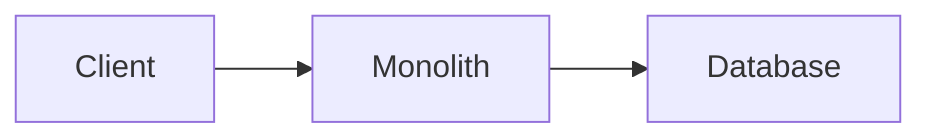
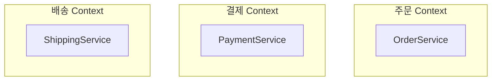
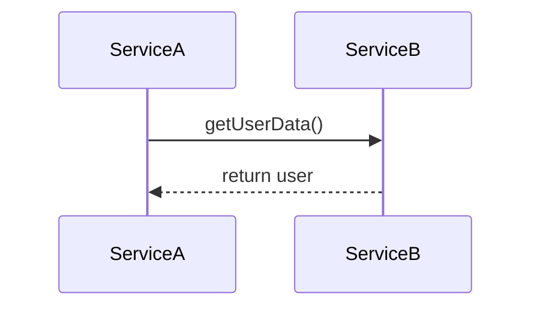
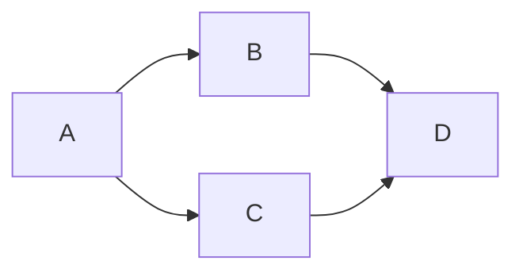
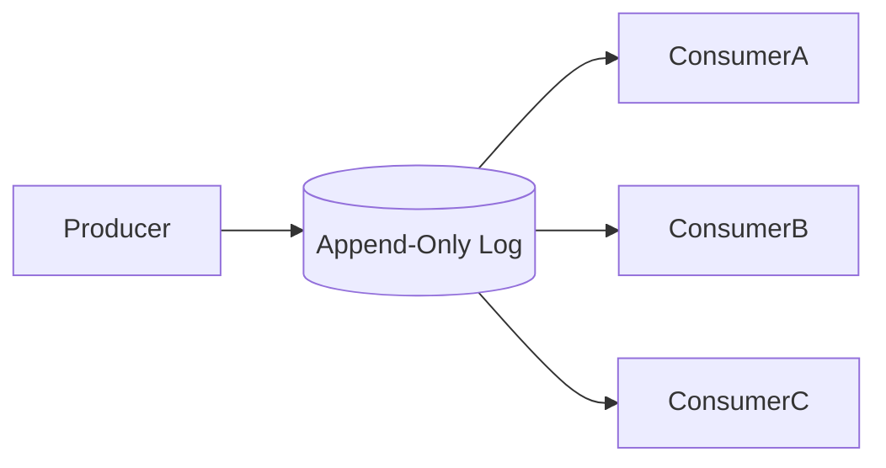
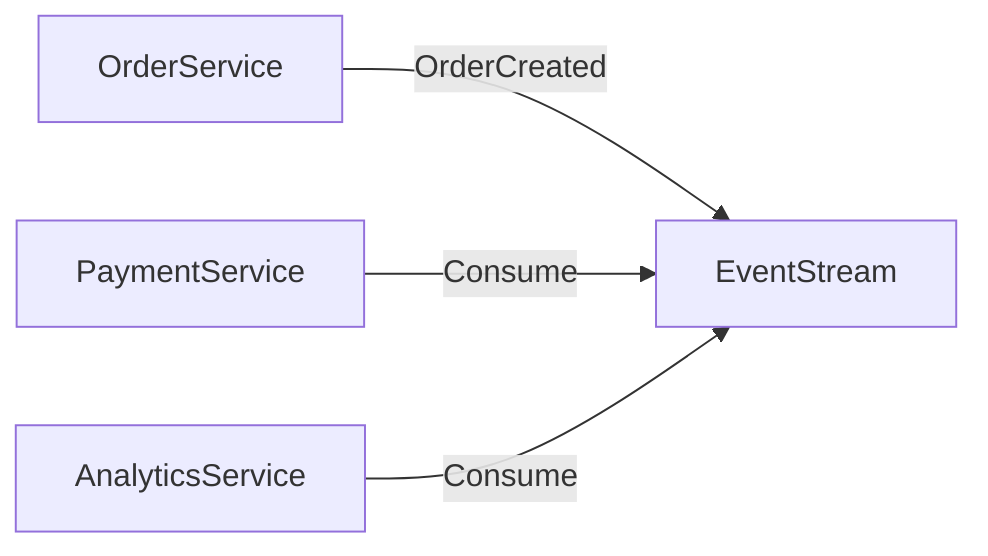
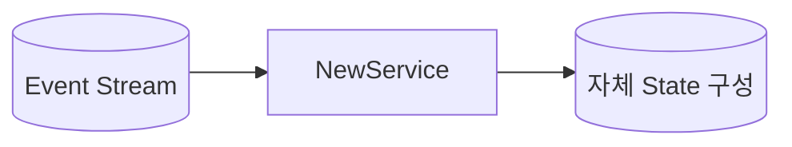
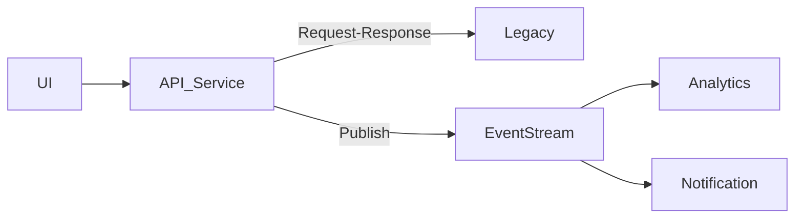

# 이벤트 기반 마이크로서비스란?

> 이 글은 Adam Bellemare의 *Building Event-Driven Microservices* 1장을 기반으로 작성했습니다.

## 1. 모놀리스에서 마이크로서비스로

초기 시스템은 대부분 모놀리식(monolithic) 구조로 시작합니다.

하나의 애플리케이션, 하나의 데이터베이스, 하나의 배포 단위. 처음에는 이게 합리적입니다. 개발이 빠르고, 디버깅이 쉽고, 배포가 간단하니까요.

하지만 시간이 지나면 세 가지 문제가 나타납니다.

### 기능 결합

하나의 코드베이스 안에서 여러 기능이 같은 데이터 모델, 같은 라이브러리, 같은 배포 파이프라인을 공유합니다. 기능 간 경계가 코드 레벨에서 명확하지 않기 때문에, 한쪽을 수정하면 다른 쪽이 영향을 받습니다.

예를 들어 이커머스 시스템에서 주문 할인 로직을 수정한다고 가정합니다. 할인 계산에 사용되는 `Product` 모델의 필드를 변경했는데, 같은 모델을 참조하는 재고 표시 로직이 함께 깨집니다. 두 기능은 비즈니스 관점에서 별개이지만, 코드 레벨에서는 같은 모델과 테이블에 의존하고 있기 때문입니다.

시스템이 커질수록 이런 의존 관계는 추적하기 어려워지고, 수정의 영향 범위를 예측할 수 없게 됩니다.

### 팀 확장 병목

모놀리스에서는 모든 팀이 하나의 코드베이스를 공유합니다. 코드 소유권이 명확하지 않고, 배포 단위도 하나입니다.

이커머스 시스템에서 주문 팀, 결제 팀, 재고 팀이 동시에 같은 저장소에서 작업한다고 가정합니다. 주문 팀이 릴리스 전 코드 프리즈에 들어가면, 결제 팀의 긴급 버그 수정도 배포할 수 없습니다. 세 팀의 변경 사항이 하나의 배포에 묶여 있기 때문입니다. merge conflict가 빈번해지고, 한 팀의 일정이 다른 팀의 일정을 제약합니다.

팀이 늘어날수록 조율 비용이 기능 개발 비용을 넘어서게 됩니다.

### 데이터 잠금

데이터가 하나의 데이터베이스에 갇혀 있습니다. 새로운 기능이나 팀이 이 데이터를 필요로 할 때, 선택지는 세 가지입니다.

1. 운영 DB에 직접 쿼리한다 — 운영 부하와 스키마 결합이 발생합니다
2. 데이터를 소유한 팀에 API를 요청한다 — 해당 팀의 일정에 의존하게 됩니다
3. 배치로 데이터를 복사한다 — 지연이 생기고 데이터 불일치가 발생합니다

예를 들어 분석 팀이 주문 데이터를 기반으로 대시보드를 만들려고 합니다. 주문 데이터는 주문 서비스의 DB에만 존재합니다. 분석 팀은 주문 팀에 API를 만들어달라고 요청하거나, 운영 DB를 직접 조회해야 합니다. 어느 쪽이든 주문 서비스의 내부 구현에 결합됩니다.

이러한 한계를 극복하기 위해 등장한 것이 마이크로서비스입니다. 마이크로서비스는 **하나의 명확한 비즈니스 책임만 수행하는 작은 독립 서비스**입니다. 아마존의 Two-Pizza Rule처럼, 한 팀은 피자 두 판으로 배부를 수 있는 규모여야 합니다. 작은 팀, 명확한 소유권, 독립적 운영이 핵심입니다.

## 2. Bounded Context와 서비스 분리

모놀리스의 한계를 인식했다면, 다음 질문은 "어떤 기준으로 서비스를 나눌 것인가"입니다. 서비스를 분리하는 기준은 크게 두 가지가 있습니다.

### 기술 중심 분리

기술 레이어(UI, API, DB) 단위로 나누는 방식입니다. 이렇게 나누면 팀도 프론트 팀, API 팀, DB 팀으로 나뉩니다. 모든 기능이 여러 팀을 거쳐야 하고, 변경이 느려집니다.

### 비즈니스 중심 분리

각 팀이 하나의 비즈니스 도메인을 책임집니다. 책임이 명확하고, 데이터 모델이 독립적이며, 변경 영향이 최소화됩니다. 이것이 DDD(Domain-Driven Design)의 **Bounded Context** 개념과 자연스럽게 연결됩니다.

Bounded Context는 같은 용어라도 맥락에 따라 다른 의미를 가질 수 있다는 점을 인정합니다. 예를 들어 "상품"이라는 개념은 주문 Context에서는 주문 항목(수량, 가격)이고, 재고 Context에서는 창고 내 물리적 재고(위치, 수량)입니다. 각 Context는 자신에게 필요한 형태로 데이터를 소유하고 관리합니다.

## 3. Request-Response의 한계

비즈니스 경계를 기준으로 서비스를 나눈 뒤에도, 이 서비스들은 서로 통신해야 합니다. 가장 자연스럽게 떠오르는 방식은 Request-Response입니다.

하나의 서비스가 다른 서비스에 요청을 보내고 응답을 기다리는 구조입니다. 하지만 이 방식에는 구조적 한계가 있습니다.

### 의존성 폭발

A가 B, C에 의존하고, B와 C가 다시 D에 의존합니다. D에 장애가 나면 전체가 영향을 받습니다. 서비스를 나누었지만 사실상 하나처럼 동작합니다. 이것을 **Distributed Monolith**(분산 모놀리스)라고 부릅니다.

### 스케일 종속성

Service A에 갑자기 트래픽이 폭증하면 A만 확장하는 것으로는 부족합니다. B와 C도 함께 확장해야 합니다. 서비스는 논리적으로 분리되어 있지만, 물리적으로 강하게 연결되어 있습니다.

### 데이터 접근이 구현에 묶여 있음

Request-Response 구조에서는 데이터를 얻으려면 그 데이터를 소유한 서비스를 직접 호출해야 합니다.

이커머스 시스템에서 결제 서비스가 사용자 정보를 필요로 한다고 가정합니다. 결제 서비스는 사용자 서비스의 API 엔드포인트, 인증 방식, 응답 포맷을 알아야 합니다. 사용자 서비스가 내부 스키마를 변경하면, 이 API에 의존하는 결제 서비스의 연동이 깨질 수 있습니다.

여기에 분석 서비스, 추천 서비스 등 다른 팀도 같은 사용자 데이터가 필요하다면, 각각 사용자 서비스와의 연동을 별도로 구축해야 합니다. 데이터가 서비스의 구현 내부에 갇혀 있기 때문에, 데이터에 접근하려면 반드시 그 서비스의 구현을 경유해야 합니다.

결국 **데이터가 서비스 구현의 인질**이 되는 구조입니다. 데이터 자체는 여러 팀이 활용할 수 있는 자산이지만, 접근 경로가 특정 서비스의 API에 묶여 있어서 자유롭게 사용할 수 없습니다.

## 4. 데이터 커뮤니케이션 구조

Request-Response의 한계를 세 가지로 살펴봤습니다. 이 문제들이 발생하는 구조적 원인을 살펴봅니다.

조직 내 커뮤니케이션 구조는 세 가지로 구분됩니다.

| 구조 | 의미 |
|------|------|
| **Business** Communication | 사람과 팀 간의 소통 |
| **Implementation** Communication | 코드, API, DB 구조 |
| **Data** Communication | 데이터 공유 방식 |

대부분의 조직은 Business 구조와 Implementation 구조는 갖추고 있습니다. **하지만 Data 구조는 갖추지 못한 경우가 많습니다.** 그래서 DB 직접 접근, 복잡한 API 호출, 배치 복사, 데이터 불일치 같은 문제가 끊임없이 발생합니다.

§3에서 살펴본 세 가지 문제는 결국 Data Communication 구조의 부재에서 비롯됩니다. 데이터를 공유하는 공식적인 채널이 없으니, 서비스 간 직접 호출에 의존할 수밖에 없고, 그 결과 의존성 폭발, 스케일 종속, 데이터 인질 문제가 발생합니다.

이 문제의 해답은 데이터를 공유하는 새로운 방식에 있습니다.

## 5. 이벤트란 무엇인가?

Data Communication 구조가 필요하다는 것을 확인했습니다. 이 구조의 핵심 단위가 이벤트입니다.

이벤트는 **비즈니스에서 실제로 일어난 사실(Fact)**입니다.

- 주문이 생성됨
- 결제가 완료됨
- 상품이 배송됨

이벤트는 단순한 데이터 조각이 아닙니다. 특정 시점에 무엇이 일어났는지를 기록한 것이고, 그 사실을 필요로 하는 누구든 독립적으로 읽고 활용할 수 있습니다.

회사 게시판을 생각해봅니다. 영업팀이 새 계약을 체결했을 때, 영업팀이 재무팀, 물류팀, CS팀에 각각 전화를 거는 방식이 있습니다. 이것이 Request-Response입니다. 반면 게시판에 "신규 계약 체결: A사, 100대, 3월 납품"이라고 공지하면, 관련 부서가 각자의 시점에 게시판을 확인하고 필요한 조치를 취합니다. 영업팀은 누가 이 정보를 필요로 하는지 알 필요가 없고, 각 부서는 영업팀에 의존하지 않습니다.

이벤트 기반 통신은 이 게시판 모델과 유사합니다. 서비스는 자신에게 일어난 사실을 기록하고, 관심 있는 서비스가 독립적으로 이를 읽습니다. §3의 문제들에서 서비스 간 직접 호출이 만들었던 의존성과 결합이, 이 구조에서는 발생하지 않습니다.

여기서 이벤트와 메시지의 차이를 구분해야 합니다.

**메시지 큐**: 소비하면 사라집니다. 1:1 또는 1:N 전달이고, 한 번 소비된 메시지를 다시 읽기 어렵습니다. 게시판에서 공지를 읽은 사람이 공지를 떼어가는 것과 같습니다.

**이벤트 스트림**: 소비해도 삭제되지 않습니다. 여러 소비자가 독립적으로 읽을 수 있고, 과거 이벤트를 처음부터 다시 읽을 수도 있습니다. 게시판에 공지가 계속 남아 있어서 나중에 입사한 사람도 과거 공지를 모두 볼 수 있는 것과 같습니다.

## 6. 이벤트 스트림

이벤트 스트림은 §4에서 부재했던 **Data Communication 구조**를 제공합니다. 데이터가 서비스 내부에 갇혀 있지 않고, 표준화된 채널을 통해 공유됩니다.

이벤트 스트림이 무엇인지 이해하기 위해 은행 거래 원장을 생각해봅니다. 은행 계좌의 잔액은 "현재 상태"입니다. 하지만 이 잔액은 입금, 출금, 이체 같은 거래 내역이 순서대로 쌓인 결과입니다. 은행은 잔액만 저장하지 않고, 모든 거래를 시간 순서대로 기록합니다. 이 거래 기록이 원장이고, 원장이 곧 이벤트 스트림입니다.

전통적인 데이터베이스는 현재 상태를 저장합니다. 사용자의 주소가 바뀌면 기존 주소를 새 주소로 덮어씁니다. 이벤트 스트림은 다릅니다. "사용자가 주소를 변경했다"는 사실을 시간 순서대로 기록합니다. 현재 상태는 이 이벤트들을 순서대로 적용한 결과입니다.

이 구조에서 두 가지 속성이 자연스럽게 따라옵니다.

### Immutability (불변성)

이벤트는 한 번 기록되면 수정하지 않습니다. 은행 원장에서 과거 거래를 지우거나 고치지 않는 것과 같습니다. 이미 여러 서비스가 이 이벤트를 읽고 각자의 상태를 구성했을 수 있기 때문에, 수정하면 일관성이 깨집니다.

잘못된 이벤트가 발행된 경우에는 **새로운 보정 이벤트를 발행**합니다. 기존 이벤트를 고치는 게 아니라, "이전 이벤트를 정정합니다"라는 새 이벤트를 추가하는 방식입니다. 은행에서 잘못된 입금이 있으면 해당 거래 기록을 삭제하는 게 아니라 "취소" 거래를 새로 기록하는 것과 같습니다.

이 속성이 §3의 의존성 폭발 문제를 해결합니다. 이벤트가 불변이므로 여러 서비스가 같은 이벤트를 독립적으로 읽을 수 있고, 서비스 간 조율이 필요하지 않습니다.

### Replay 가능

이벤트가 삭제되지 않으므로, 새로운 서비스가 추가되면 과거 이벤트부터 읽어서 자체 상태를 구성할 수 있습니다.

이 속성이 §3의 "데이터 접근이 구현에 묶여 있음" 문제를 해결합니다. 새 서비스를 만들 때 기존 서비스에 API를 요청하거나 데이터를 달라고 할 필요가 없습니다. 이벤트 스트림만으로 필요한 상태를 독립적으로 구축할 수 있습니다.

## 7. Event-Driven Microservice의 내부 구조

Event-Driven Microservice는 **이벤트를 소비하거나 생산하는 목적 중심 서비스**입니다. 기본 동작 흐름은 다음과 같습니다.

이 서비스는 다음을 전적으로 책임집니다.

- **이벤트 소비**: 입력 스트림에서 이벤트를 읽음
- **이벤트 생산**: 처리 결과를 출력 스트림에 기록
- **상태 관리**: 자체 State Store 보유 (외부 DB를 쓸 수도 있지만, 소유권은 서비스에 있음)
- **비즈니스 로직**: 이벤트 처리, 상태 갱신, 새 이벤트 생성
- **확장성 관리**: 처리와 상태의 스케일링
- **모니터링**: 메트릭, 로깅, 헬스 체크

### Stateless vs Stateful

**Stateless** 서비스는 상태를 저장하지 않습니다. 단순 변환이나 라우팅에 적합합니다.

**Stateful** 서비스는 상태를 유지합니다. 세션 집계, 사용자 상태, 통계 계산 등 대부분의 실제 서비스가 여기에 해당합니다. 이벤트 기반 시스템에서 **상태 관리 전략은 핵심 설계 과제**입니다.

## 8. 장점 정리

Event-Driven Microservices가 가져오는 이점을 정리하면 다음과 같습니다.

| 장점 | 설명 |
|------|------|
| 느슨한 결합 | API가 아닌 이벤트 스키마(데이터 계약)에 의존 |
| 기술적 유연성 | 각 서비스가 독립적으로 기술 스택 선택 가능 |
| CI/CD 친화성 | 작은 단위 배포, 빠른 롤백, 독립 릴리스 |
| 높은 테스트 용이성 | 외부 의존 최소화, 이벤트 재생 테스트 가능 |
| 확장성 | 서비스 단위 독립 스케일링, 전체 시스템 확장 불필요 |
| 팀 독립성 | 서비스 단위 소유권 분리, 팀 재구성에도 스트림 유지 |

핵심은 서비스가 **구현이 아니라 도메인 데이터에 의존**한다는 점입니다.

## 9. 현실은 Hybrid

새 기능이 필요할 때, 전통적인 구조에서는 두 가지 선택지가 있습니다.

- **새 서비스를 만든다**: 데이터 접근이 어렵고 운영 부담이 커진다.
- **기존 서비스에 추가한다**: 빠르지만 점점 커져서 결국 모놀리스가 된다.

이벤트 기반 구조에서는 새 서비스를 만들고, 필요한 데이터는 스트림에서 구독하면 됩니다. 기존 서비스를 변경할 필요가 없습니다.

다만 현실적인 구조는 혼합입니다.

일부는 Request-Response, 일부는 Event-Driven. 혼합 구조가 일반적이며, 이것이 정상입니다.

## 10. 정리

이 장의 핵심 메시지는 다음과 같습니다.

> 시스템이 복잡해지는 이유는 **데이터 커뮤니케이션 구조가 설계되지 않았기 때문**이다.

이벤트 스트림은 데이터 공유를 1급 시민으로 만들고, 조직 확장과 팀 분리를 가능하게 합니다. 패러다임의 전환을 요약하면 이렇습니다.

| 기존 | 이벤트 기반 |
|------|------------|
| 서비스 중심 | 데이터 중심 |
| 호출 중심 | 사실(Fact) 중심 |
| 동기 의존 | 비동기 독립 |

마이크로서비스를 이해하는 데는 순서가 있습니다.

1. 먼저 **비즈니스 경계**를 이해해야 하고
2. 다음으로 **데이터가 어떻게 공유되는지**를 이해해야 하며
3. 그 다음에야 기술(Kafka, Flink 등)을 배우는 것이 맞습니다

| 개념 | 의미 |
|------|------|
| 마이크로서비스 | 작은 독립 비즈니스 서비스 |
| 이벤트 | 비즈니스에서 일어난 불변의 사실 |
| 이벤트 스트림 | 삭제되지 않는 append-only 로그 |
| 느슨한 결합 | 서비스가 구현이 아닌 데이터 계약에 의존 |
| Bounded Context | 명확한 비즈니스 경계에 따른 서비스 분리 |
| Data Communication | 데이터 공유를 위한 공식 채널 (이벤트 스트림) |
