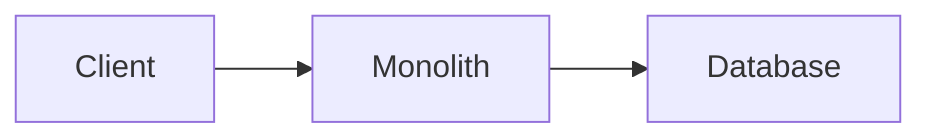
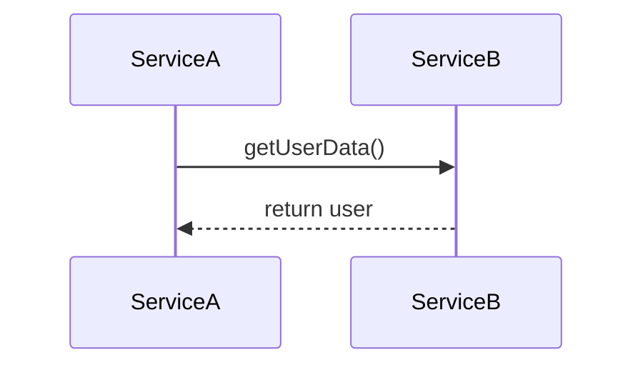
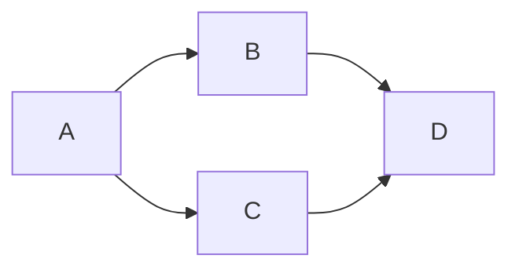
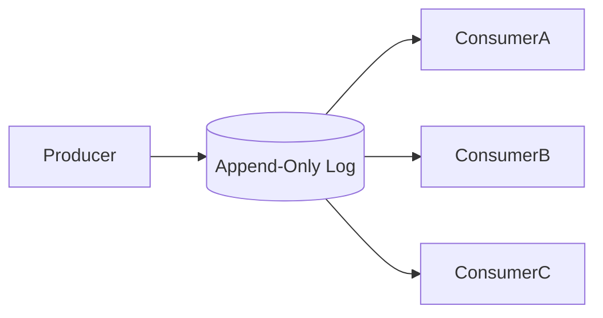
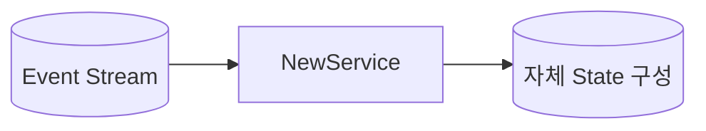
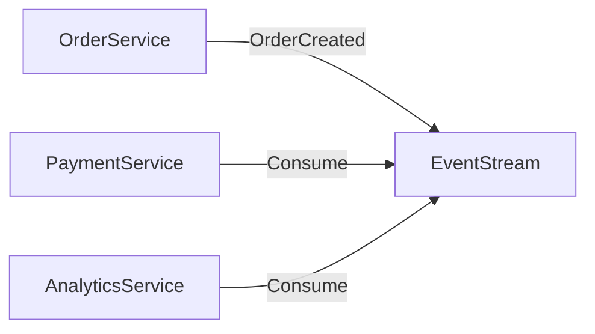
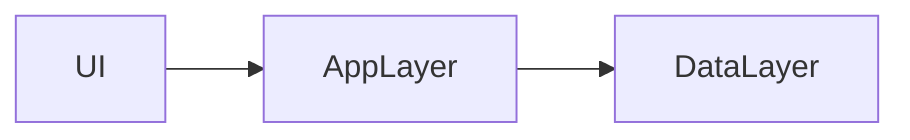
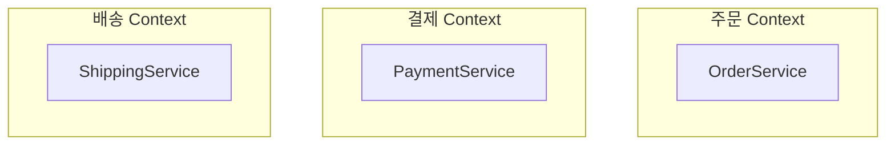
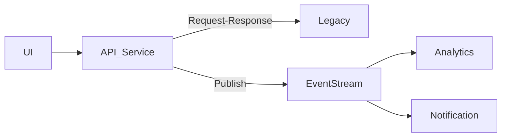

# 이벤트 기반 마이크로서비스란?

> 이 글은 Adam Bellemare의 *Building Event-Driven Microservices* 1장을 기반으로 작성했습니다.

## 1. 모놀리스에서 마이크로서비스로

초기 시스템은 대부분 모놀리식(monolithic) 구조로 시작합니다.

하나의 애플리케이션, 하나의 데이터베이스, 하나의 배포 단위. 처음에는 이게 합리적입니다. 개발이 빠르고, 디버깅이 쉽고, 배포가 간단하니까요.

하지만 시간이 지나면 세 가지 문제가 나타납니다.

**기능 결합**: A 기능을 수정하면 B 기능이 깨집니다. 전체 코드를 이해하지 않으면 수정 자체가 불가능해집니다.

**팀 확장 병목**: 여러 팀이 같은 코드베이스에서 작업하면서 merge conflict가 늘어나고, 책임 경계가 불명확해집니다.

**데이터 잠금**: 데이터가 하나의 DB에 갇혀 있습니다. 새로운 서비스가 이 데이터를 필요로 할 경우, 기존 DB에 직접 접근하거나, API를 만들거나, 배치로 복사해야 합니다. 모두 복잡하고 결합을 증가시킵니다.

이러한 한계를 극복하기 위해 등장한 것이 마이크로서비스입니다. 마이크로서비스는 **하나의 명확한 비즈니스 책임만 수행하는 작은 독립 서비스**입니다. 아마존의 Two-Pizza Rule처럼, 한 팀은 피자 두 판으로 배부를 수 있는 규모여야 합니다. 작은 팀, 명확한 소유권, 독립적 운영이 핵심입니다.

## 2. Request-Response의 한계

마이크로서비스로 나눈 뒤에도 서비스끼리 통신해야 합니다. 가장 익숙한 방식은 Request-Response입니다.

겉보기엔 단순합니다. 하지만 세 가지 근본적인 문제가 있습니다.

### 의존성 폭발 (Dependency Explosion)

A가 B, C에 의존하고, B와 C가 다시 D에 의존합니다. D에 장애가 나면 전체가 영향을 받습니다. 서비스를 나누었지만 사실상 하나처럼 동작합니다. 이것을 **Distributed Monolith**(분산 모놀리스)라고 부릅니다.

### 스케일 종속성

Service A에 갑자기 트래픽이 폭증하면 A만 확장하는 것으로는 부족합니다. B와 C도 함께 확장해야 합니다. 서비스는 논리적으로 분리되어 있지만, 물리적으로 강하게 연결되어 있습니다.

### 데이터 접근이 구현에 묶여 있음

데이터를 얻으려면 그 서비스를 호출해야 합니다. 즉, **데이터가 서비스의 구현 내부에 갇혀 있고**, 다른 팀이 마음대로 사용할 수 없습니다.

## 3. 이벤트란 무엇인가?

이벤트는 **비즈니스에서 실제로 일어난 사실(Fact)**입니다.

- 주문이 생성됨
- 결제가 완료됨
- 상품이 배송됨

여기서 이벤트와 메시지의 차이를 구분해야 합니다.

**메시지 큐**: 소비하면 사라집니다. 1:1 또는 1:N 전달이고, 재처리가 어렵습니다.

**이벤트 스트림**: 삭제되지 않습니다. 여러 소비자가 독립적으로 읽을 수 있고, 처음부터 다시 읽을 수도 있습니다.

이벤트 스트림은 변경 불가능한(append-only) 로그입니다. 새 이벤트는 뒤에 추가될 뿐, 기존 이벤트를 수정하거나 삭제하지 않습니다.

## 4. 이벤트 스트림의 핵심 속성

### Immutability (불변성)

이벤트는 한 번 기록되면 수정하지 않습니다. 이미 여러 서비스가 읽었을 수 있기 때문입니다. 수정하면 일관성이 깨집니다.

잘못된 이벤트가 발행된 경우에는 **새로운 보정 이벤트를 발행**합니다. 기존 이벤트를 고치는 게 아니라, "이전 이벤트를 정정합니다"라는 새 이벤트를 추가하는 방식입니다.

### Replay 가능

새로운 서비스가 추가되면 과거 이벤트부터 읽어서 자체 상태를 구성할 수 있습니다.

새 서비스를 만들 때 기존 서비스에 데이터를 요청할 필요가 없습니다. 이벤트 스트림만으로 자체 상태를 구축할 수 있습니다.

## 5. 데이터 커뮤니케이션 구조

조직 내 커뮤니케이션 구조는 세 가지로 구분됩니다.

| 구조 | 의미 |
|------|------|
| **Business** Communication | 사람과 팀 간의 소통 |
| **Implementation** Communication | 코드, API, DB 구조 |
| **Data** Communication | 데이터 공유 방식 |

대부분의 조직은 Business 구조와 Implementation 구조는 갖추고 있습니다. **하지만 Data 구조는 갖추지 못한 경우가 많습니다.** 그래서 DB 직접 접근, 복잡한 API 호출, 배치 복사, 데이터 불일치 같은 문제가 끊임없이 발생합니다.

Event Stream은 **공식적인 데이터 공유 채널** 역할을 합니다.

이제 데이터는 서비스 내부에 갇혀 있지 않고, 표준화된 방식으로 공유됩니다.

## 6. Bounded Context와 서비스 분리

서비스를 분리하는 기준은 크게 두 가지가 있습니다.

### 기술 중심 분리

기술 레이어(UI, API, DB) 단위로 나누는 방식입니다. 이렇게 나누면 팀도 프론트 팀, API 팀, DB 팀으로 나뉩니다. 모든 기능이 여러 팀을 거쳐야 하고, 변경이 느려집니다.

### 비즈니스 중심 분리

각 팀이 하나의 비즈니스 도메인을 책임집니다. 책임이 명확하고, 데이터 모델이 독립적이며, 변경 영향이 최소화됩니다. 이것이 DDD(Domain-Driven Design)의 **Bounded Context** 개념과 자연스럽게 연결됩니다.

## 7. Event-Driven Microservice의 내부 구조

Event-Driven Microservice는 **이벤트를 소비하거나 생산하는 목적 중심 서비스**입니다. 기본 동작 흐름은 다음과 같습니다.

이 서비스는 다음을 전적으로 책임집니다.

- **이벤트 소비**: 입력 스트림에서 이벤트를 읽음
- **이벤트 생산**: 처리 결과를 출력 스트림에 기록
- **상태 관리**: 자체 State Store 보유 (외부 DB를 쓸 수도 있지만, 소유권은 서비스에 있음)
- **비즈니스 로직**: 이벤트 처리, 상태 갱신, 새 이벤트 생성
- **확장성 관리**: 처리와 상태의 스케일링
- **모니터링**: 메트릭, 로깅, 헬스 체크

### Stateless vs Stateful

**Stateless** 서비스는 상태를 저장하지 않습니다. 단순 변환이나 라우팅에 적합합니다.

**Stateful** 서비스는 상태를 유지합니다. 세션 집계, 사용자 상태, 통계 계산 등 대부분의 실제 서비스가 여기에 해당합니다. 이벤트 기반 시스템에서 **상태 관리 전략은 핵심 설계 과제**입니다.

## 8. 장점 정리

Event-Driven Microservices가 가져오는 이점을 정리하면 다음과 같습니다.

| 장점 | 설명 |
|------|------|
| 느슨한 결합 | API가 아닌 이벤트 스키마(데이터 계약)에 의존 |
| 기술적 유연성 | 각 서비스가 독립적으로 기술 스택 선택 가능 |
| CI/CD 친화성 | 작은 단위 배포, 빠른 롤백, 독립 릴리스 |
| 높은 테스트 용이성 | 외부 의존 최소화, 이벤트 재생 테스트 가능 |
| 확장성 | 서비스 단위 독립 스케일링, 전체 시스템 확장 불필요 |
| 팀 독립성 | 서비스 단위 소유권 분리, 팀 재구성에도 스트림 유지 |

핵심은 서비스가 **구현이 아니라 도메인 데이터에 의존**한다는 점입니다.

## 9. 현실은 Hybrid

새 기능이 필요할 때, 전통적인 구조에서는 두 가지 선택지가 있습니다.

- **새 서비스를 만든다**: 데이터 접근이 어렵고 운영 부담이 커진다.
- **기존 서비스에 추가한다**: 빠르지만 점점 커져서 결국 모놀리스가 된다.

이벤트 기반 구조에서는 새 서비스를 만들고, 필요한 데이터는 스트림에서 구독하면 됩니다. 기존 서비스를 변경할 필요가 없습니다.

다만 현실적인 구조는 혼합입니다.

일부는 Request-Response, 일부는 Event-Driven. 혼합 구조가 일반적이며, 이것이 정상입니다.

## 10. 정리

이 장의 핵심 메시지는 다음과 같습니다.

> 시스템이 복잡해지는 이유는 **데이터 커뮤니케이션 구조가 설계되지 않았기 때문**이다.

이벤트 스트림은 데이터 공유를 1급 시민으로 만들고, 조직 확장과 팀 분리를 가능하게 합니다. 패러다임의 전환을 요약하면 이렇습니다.

| 기존 | 이벤트 기반 |
|------|------------|
| 서비스 중심 | 데이터 중심 |
| 호출 중심 | 사실(Fact) 중심 |
| 동기 의존 | 비동기 독립 |

마이크로서비스를 이해하는 데는 순서가 있습니다.

1. 먼저 **비즈니스 경계**를 이해해야 하고
2. 다음으로 **데이터가 어떻게 공유되는지**를 이해해야 하며
3. 그 다음에야 기술(Kafka, Flink 등)을 배우는 것이 맞습니다

| 개념 | 의미 |
|------|------|
| 마이크로서비스 | 작은 독립 비즈니스 서비스 |
| 이벤트 | 비즈니스에서 일어난 불변의 사실 |
| 이벤트 스트림 | 삭제되지 않는 append-only 로그 |
| 느슨한 결합 | 서비스가 구현이 아닌 데이터 계약에 의존 |
| Bounded Context | 명확한 비즈니스 경계에 따른 서비스 분리 |
| Data Communication | 데이터 공유를 위한 공식 채널 (이벤트 스트림) |
