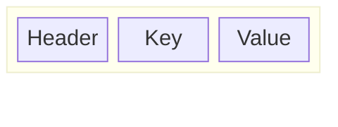
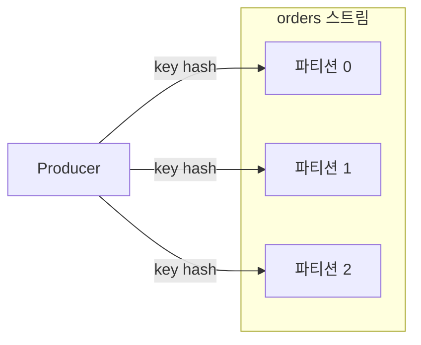
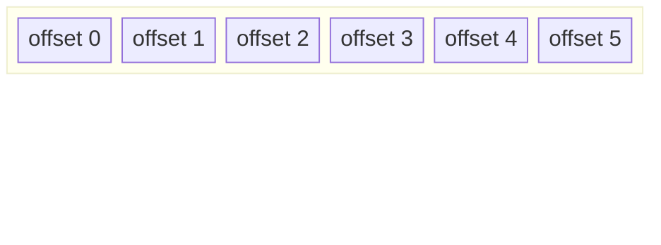
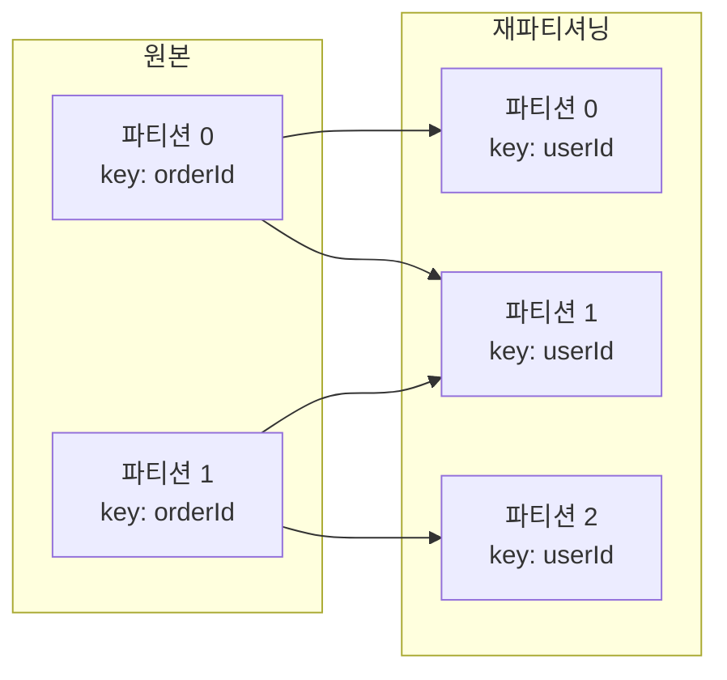
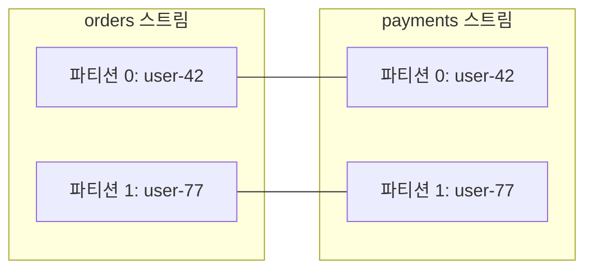
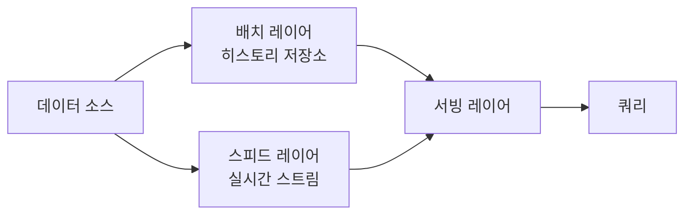
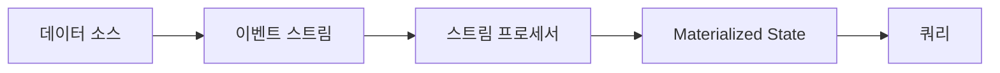

# 이벤트와 이벤트 스트림의 기초

> 이 글은 Adam Bellemare의 *Building Event-Driven Microservices* 2장을 기반으로 작성했습니다.

1장에서는 이벤트 기반 마이크로서비스가 **왜** 필요한지를 다뤘습니다. 모놀리스의 한계, Bounded Context, Request-Response의 구조적 문제, 그리고 이벤트 스트림이 Data Communication 구조를 제공한다는 점까지 살펴봤습니다.

이 장에서는 이벤트의 **구조**, **유형**, 스트림의 **속성**, 그리고 스트림 위에서 수행할 수 있는 **연산**을 다룹니다. "이벤트란 비즈니스에서 일어난 사실"이라는 정의를 넘어, 이벤트가 실제로 어떤 모양이고, 어떻게 분류되며, 스트림이 어떤 보장을 제공하는지 구체적으로 살펴봅니다.

## 1. 이벤트의 구조

이벤트는 세 가지 요소로 구성됩니다.



| 요소 | 역할 | 예시 |
|------|------|------|
| **Header** | 메타데이터. 이벤트 자체에 대한 정보 | timestamp, trackingId, eventType |
| **Key** | 이벤트가 속하는 엔티티의 식별자 | orderId, userId, productId |
| **Value** | 이벤트의 실제 내용 | 주문 상세, 변경된 필드, 상태 정보 |

이커머스 시스템에서 주문 생성 이벤트를 예로 들면 다음과 같습니다.

```
Header: { timestamp: "2025-03-08T10:00:00Z", eventType: "OrderCreated", trackingId: "abc-123" }
Key:    "order-7891"
Value:  { userId: "user-42", items: [{ productId: "P001", qty: 2 }], totalPrice: 59000 }
```

이 세 부분이 분리되어 있는 이유가 있습니다. Header는 이벤트의 라우팅과 추적에 사용되고, Key는 파티셔닝과 그룹핑의 기준이 되며, Value는 소비자가 처리할 실제 데이터를 담습니다. 각 요소가 서로 다른 목적을 수행하기 때문에 구조적으로 분리됩니다.

## 2. 이벤트의 세 가지 유형

이벤트의 구조를 확인했으니, 이제 이벤트가 어떤 종류로 나뉘는지 살펴봅니다. Key와 Value의 사용 방식에 따라 세 가지 유형이 있습니다.

### Unkeyed Event

Key가 없는 이벤트입니다. 개별 측정값이나 로그처럼, 특정 엔티티에 귀속되지 않는 독립적 사실을 나타냅니다.

```
Key:   null
Value: { page: "/products/P001", action: "click", referrer: "/home" }
```

웹사이트의 페이지 클릭 이벤트가 대표적입니다. 각 클릭은 독립적이고, 특정 키로 그룹핑할 필요가 없습니다. Key가 없으므로 이벤트가 어느 파티션으로 갈지 정해지지 않고, 라운드 로빈 등으로 분배됩니다.

### Keyed Event

Key가 있는 이벤트입니다. 특정 엔티티와 연관된 사실을 나타냅니다.

```
Key:   "user-42"
Value: { orderId: "order-7891", totalPrice: 59000, action: "created" }
```

같은 Key를 가진 이벤트는 같은 파티션으로 보내집니다. 이 속성이 중요한 이유는 **데이터 로컬리티** 때문입니다. 같은 사용자의 모든 주문 이벤트가 같은 파티션에 모여 있으면, 해당 사용자의 주문 내역을 집계하거나 패턴을 분석할 때 여러 파티션을 조회할 필요가 없습니다.

### Entity Event

엔티티의 **현재 전체 상태**를 담은 이벤트입니다. 데이터베이스의 행(row)과 유사합니다.

```
Key:   "product-P001"
Value: { name: "무선 키보드", price: 59000, stock: 142, category: "전자기기" }
```

상품의 가격이 변경되면 기존 이벤트를 수정하는 것이 아니라, 변경된 전체 상태를 담은 새 이벤트를 발행합니다. 소비자는 같은 Key의 최신 이벤트를 읽으면 해당 엔티티의 현재 상태를 알 수 있습니다.

이 방식을 **ECST(Event-Carried State Transfer)**라고 합니다. 소비자가 데이터를 얻기 위해 원본 서비스를 호출할 필요 없이, 이벤트 자체에 필요한 상태가 모두 담겨 있습니다. 1장에서 다뤘던 "데이터가 서비스 구현의 인질이 되는" 문제를 해결하는 구체적인 메커니즘입니다.

### 세 유형의 관계

세 유형은 독립적인 분류가 아니라 점진적으로 구조화되는 스펙트럼입니다.

| 유형 | Key | Value | 용도 |
|------|-----|-------|------|
| Unkeyed | 없음 | 독립적 측정값 | 로그, 클릭 이벤트 |
| Keyed | 있음 | 엔티티 관련 사실 | 주문, 결제, 행동 추적 |
| Entity | 있음 | 엔티티 전체 상태 | 상품 정보, 사용자 프로필 |

Unkeyed에서 Entity로 갈수록 이벤트가 더 많은 맥락을 담고, 소비자의 독립성이 높아집니다.

## 3. 이벤트 스트림의 핵심 속성

이벤트의 구조와 유형을 살펴봤으니, 이 이벤트들이 쌓이는 이벤트 스트림이 어떤 속성을 갖는지 정리합니다. 1장에서 불변성과 재생 가능성을 다뤘는데, 이 장에서는 여섯 가지 속성을 체계적으로 살펴봅니다.

### Immutability (불변성)

1장에서 다뤘듯이, 이벤트는 한 번 기록되면 수정하지 않습니다. 은행 원장에서 과거 거래를 고치지 않는 것과 같습니다. 잘못된 이벤트는 보정 이벤트를 발행하여 정정합니다.

### Partitioned (파티션 분할)

하나의 이벤트 스트림은 여러 파티션으로 나뉩니다.



파티션은 대규모 데이터 처리를 위한 분할 단위입니다. 이벤트의 Key를 해싱하여 어느 파티션에 저장할지 결정합니다. 파티션 단위로 소비자를 할당할 수 있으므로, 파티션 수를 늘리면 병렬 처리 능력이 높아집니다.

### Indexed (인덱싱)

각 파티션 내에서 이벤트는 고유한 offset을 가집니다.



offset은 해당 파티션 내에서 이벤트를 고유하게 식별합니다. 소비자는 "파티션 1의 offset 42부터 읽겠다"처럼 정확한 위치를 지정할 수 있습니다. 이 인덱싱 덕분에 소비자가 어디까지 읽었는지 추적하고, 중단된 지점부터 이어서 읽는 것이 가능합니다.

### Ordered (순서 보장)

파티션 내에서 이벤트는 기록된 순서대로 정렬됩니다. offset 3은 반드시 offset 2 이후에 기록된 이벤트입니다.

단, 순서 보장은 **파티션 내에서만** 적용됩니다. 서로 다른 파티션 간에는 순서가 보장되지 않습니다. 이것이 Key 설계가 중요한 이유입니다. 순서가 중요한 이벤트들은 같은 Key를 가져야 같은 파티션에 들어가고, 순서가 보장됩니다.

### Durability & Replayability (내구성과 재생 가능성)

이벤트는 소비되어도 삭제되지 않습니다. 1장의 게시판 비유에서 공지를 읽어도 공지가 사라지지 않는 것과 같습니다. 이 덕분에 새로운 서비스가 추가되면 과거 이벤트부터 읽어서 자체 상태를 구축할 수 있습니다.

여러 소비자가 같은 스트림을 독립적으로 읽을 수 있고, 각자의 offset을 별도로 관리합니다. 한 소비자가 offset 100까지 읽었다고 해서 다른 소비자에게 영향을 주지 않습니다.

### Indefinite Retention (무기한 보관)

이벤트 스트림은 데이터를 무기한 보관할 수 있습니다. 메시지 큐처럼 소비 후 삭제되거나, 일정 기간 후 만료되는 것이 아닙니다. 물론 무한히 쌓이는 데이터를 관리하는 방법이 필요한데, 이는 뒤의 Compaction 섹션에서 다룹니다.

이 여섯 가지 속성이 이벤트 스트림을 단순한 메시징 시스템과 구별합니다. 다음 섹션에서 이 차이를 명확히 비교합니다.

## 4. 메시징 방식 비교

이벤트 스트림의 속성을 정리했으니, 다른 메시징 방식과 비교하여 왜 이벤트 스트림이 Data Communication의 backbone이 되는지 살펴봅니다.

### Ephemeral Messaging (휘발성 메시징)

발신자가 메시지를 보내면 수신자가 그 순간 받지 못하면 사라집니다. 전화 통화와 같습니다. 상대방이 전화를 받지 않으면 메시지가 전달되지 않습니다. Fire-and-forget 방식의 UDP 통신이나 WebSocket 푸시가 여기에 해당합니다.

### Queue-Based Messaging (큐 기반 메시징)

메시지가 큐에 저장되고, 소비자가 가져가면 삭제됩니다. 우편함과 같습니다. 편지가 도착하면 우편함에 보관되지만, 누군가 가져가면 사라집니다. 여러 소비자가 있으면 경쟁적으로 소비합니다. 하나의 메시지는 하나의 소비자만 처리합니다.

### Event Stream (이벤트 스트림)

이벤트가 기록되고, 소비해도 삭제되지 않습니다. 1장의 게시판 비유가 여기에 해당합니다. 공지가 게시판에 계속 남아 있어서 여러 사람이 독립적으로 읽을 수 있고, 나중에 온 사람도 과거 공지를 모두 볼 수 있습니다.

| 방식 | 지속성 | 재생 가능 | 다중 소비자 | 순서 보장 |
|------|--------|----------|-----------|----------|
| Ephemeral | X | X | 동시 수신만 | X |
| Queue | O | X | 경쟁적 | X |
| Event Stream | O | O | 독립적 | O (파티션 내) |

이벤트 스트림만이 지속성, 재생 가능성, 독립적 다중 소비, 순서 보장을 모두 제공합니다. 이것이 이벤트 스트림이 이벤트 기반 마이크로서비스의 backbone이 되는 이유입니다.

## 5. 이벤트 스트림 위의 연산

이벤트 스트림이 어떤 속성을 갖는지 확인했으니, 이 스트림 위에서 어떤 연산을 수행할 수 있는지 살펴봅니다. 네 가지 핵심 연산이 있습니다.

### Repartitioning (재파티셔닝)

이벤트를 다른 Key나 다른 파티션 수로 재분배하는 연산입니다.



주문 이벤트가 orderId를 Key로 파티셔닝되어 있는데, 사용자별 분석을 하려면 userId로 재파티셔닝해야 합니다. 재파티셔닝은 원본 스트림을 수정하지 않고, 새로운 스트림을 생성합니다.

### Copartitioning (코파티셔닝)

두 스트림이 **같은 Key, 같은 파티션 수, 같은 파티셔닝 전략**을 사용하면 코파티셔닝 되어 있다고 합니다.



코파티셔닝이 보장되면, 같은 Key의 이벤트가 두 스트림 모두에서 같은 파티션 번호에 위치합니다. 하나의 소비자 인스턴스가 두 스트림의 같은 파티션을 담당하면, 같은 사용자의 주문과 결제 데이터를 로컬에서 join할 수 있습니다. 네트워크 호출 없이 두 스트림의 데이터를 결합할 수 있다는 뜻입니다.

코파티셔닝이 되어 있지 않다면 먼저 Repartitioning으로 맞춰야 합니다.

### Aggregation (집계)

Keyed 이벤트를 Key 기준으로 집계하는 연산입니다.

이커머스에서 사용자별 총 주문 금액을 계산하는 경우를 예로 들면, userId로 키가 부여된 주문 이벤트 스트림에서 같은 userId의 totalPrice를 누적 합산합니다.

```
입력 이벤트:
  { key: "user-42", value: { totalPrice: 59000 } }
  { key: "user-42", value: { totalPrice: 23000 } }
  { key: "user-77", value: { totalPrice: 41000 } }

집계 결과:
  user-42 → 82000
  user-77 → 41000
```

집계 결과는 새로운 이벤트가 들어올 때마다 업데이트됩니다. 배치 처리가 아니라 연속적인 스트림 처리입니다.

### Materialization (구체화)

Entity 이벤트 스트림을 테이블 형태로 변환하는 연산입니다.


Entity 이벤트 스트림에서 각 Key의 최신 이벤트만 모으면 테이블이 됩니다. 상품 이벤트 스트림을 Materialize하면 현재 상품 카탈로그 테이블이 만들어집니다. 반대로, 테이블의 모든 변경을 시간순으로 기록하면 이벤트 스트림이 됩니다.

이것이 **Stream-Table Duality**(스트림-테이블 이중성)입니다. 스트림과 테이블은 같은 데이터의 두 가지 표현입니다. 스트림은 "무엇이 일어났는지"(변경 이력)이고, 테이블은 "지금 상태가 무엇인지"(현재 스냅샷)입니다.

## 6. Compaction

§3에서 이벤트 스트림이 무기한 보관을 지원한다고 했습니다. 하지만 이벤트가 무한히 쌓이면 저장 공간과 재생 시간이 문제가 됩니다. 이를 관리하는 메커니즘이 Tombstone과 Compaction입니다.

### Tombstone

Entity 이벤트에서 특정 Key의 엔티티가 삭제되었음을 나타내려면, 해당 Key에 대해 Value를 null로 설정한 이벤트를 발행합니다.

```
Key:   "product-P099"
Value: null
```

이것이 Tombstone(묘비석)입니다. "이 Key의 엔티티는 더 이상 존재하지 않는다"는 신호입니다.

### Log Compaction

같은 Key에 대해 여러 이벤트가 쌓여 있을 때, 최신 이벤트만 유지하고 나머지를 제거하는 과정입니다.

```mermaid
flowchart TB
    subgraph "Compaction 전"
        direction LR
        A1["P001: 가격 49000"]
        A2["P002: 가격 32000"]
        A3["P001: 가격 55000"]
        A4["P001: 가격 59000"]
        A5["P002: null"]
    end
    subgraph "Compaction 후"
        direction LR
        B1["P001: 가격 59000"]
        B2["&#8205;"]
    end
```



Compaction 후 P001은 최신 상태(가격 59000)만 남고, P002는 Tombstone이므로 완전히 제거됩니다. 이 과정은 데이터의 의미를 변경하지 않습니다. Entity 이벤트에서 중요한 것은 각 Key의 최신 상태이므로, 이전 버전을 제거해도 현재 상태 조회에 영향이 없습니다.

Compaction은 스트림의 크기를 관리 가능한 수준으로 유지하면서도, 새로운 소비자가 전체 이벤트를 재생할 때 필요한 최소한의 데이터는 보존합니다.

## 7. Kappa Architecture vs Lambda Architecture

이벤트 스트림의 속성과 연산을 살펴봤으니, 이것을 기반으로 전체 데이터 처리 아키텍처를 어떻게 구성할 수 있는지 두 가지 접근법을 비교합니다.

### Lambda Architecture



Lambda는 실시간 처리(스피드 레이어)와 배치 처리(배치 레이어)를 별도로 운영합니다. 실시간 결과는 빠르지만 근사치이고, 배치 결과는 정확하지만 느립니다. 서빙 레이어에서 두 결과를 병합합니다.

이 구조에는 실질적인 문제들이 있습니다.

- **두 개의 코드 경로**: 같은 비즈니스 로직을 배치용과 스트림용으로 각각 구현해야 합니다
- **데이터 불일치**: 두 경로의 결과가 일시적으로 다를 수 있고, 병합 시점에 따라 불일치가 발생합니다
- **운영 복잡성**: 배치 시스템과 스트림 시스템을 모두 유지보수해야 합니다
- **디버깅 어려움**: 문제가 발생했을 때 어느 레이어에서 문제인지 추적이 어렵습니다

### Kappa Architecture



Kappa는 이벤트 스트림 하나만으로 현재와 과거 데이터를 모두 처리합니다. 단일 코드 경로, 단일 데이터 소스입니다.

이것이 가능한 이유는 §3에서 살펴본 이벤트 스트림의 속성 때문입니다. 이벤트가 불변이고, 무기한 보관되며, 재생 가능하므로, 별도의 배치 저장소가 필요하지 않습니다. 로직을 변경해야 하면 스트림을 처음부터 재생하여 새로운 상태를 구축하면 됩니다.

| 관점 | Lambda | Kappa |
|------|--------|-------|
| 코드 경로 | 배치 + 스트림 (2개) | 스트림 (1개) |
| 데이터 소스 | 히스토리 저장소 + 스트림 | 이벤트 스트림 |
| 재처리 방식 | 배치 재실행 | 스트림 재생 |
| 운영 복잡성 | 높음 | 낮음 |
| 데이터 일관성 | 병합 시점에 의존 | 단일 소스 |

Kappa가 모든 상황에서 우월한 것은 아닙니다. 이벤트 스트림의 재생이 실용적이지 않을 만큼 데이터가 방대하거나, 기존 배치 인프라가 확립된 경우에는 Lambda가 현실적인 선택일 수 있습니다. 하지만 이벤트 스트림의 속성을 제대로 활용한다면, Kappa는 더 단순하고 일관된 아키텍처를 제공합니다.

## 8. 스키마와 이벤트 브로커

이벤트의 구조부터 아키텍처 패턴까지 살펴봤습니다. 마지막으로 이벤트 기반 시스템을 운영하기 위한 두 가지 기반 요소를 짚고 넘어갑니다.

### 스키마

스키마는 Producer와 Consumer 간의 **데이터 계약**입니다. 이벤트의 Key와 Value가 어떤 필드를 포함하고, 각 필드의 타입이 무엇인지 정의합니다.

스키마가 없으면 Producer가 이벤트 구조를 변경할 때 Consumer가 예기치 않게 깨집니다. 스키마가 있으면 변경 사항이 호환되는지 사전에 검증할 수 있습니다. Avro, Protobuf, JSON Schema 등이 사용됩니다. 스키마 진화(Schema Evolution)와 호환성 관리는 이후 장에서 자세히 다룹니다.

### 이벤트 브로커

이벤트 브로커는 이벤트 스트림을 저장하고 관리하는 인프라입니다. 이 장에서 다룬 파티셔닝, 인덱싱, 순서 보장, 내구성, 무기한 보관, Compaction 같은 속성들을 실제로 구현하는 것이 브로커의 역할입니다.

브로커가 제공해야 하는 핵심 기능은 다음과 같습니다.

| 기능 | 설명 |
|------|------|
| Scalability | 파티션 기반 수평 확장 |
| Durability | 복제를 통한 데이터 보존 |
| High Availability | 브로커 장애 시에도 서비스 지속 |
| High Performance | 대량 이벤트의 저지연 처리 |

Apache Kafka가 대표적인 이벤트 브로커이며, Apache Pulsar, Amazon Kinesis, Redpanda 등도 유사한 역할을 합니다.

## 9. 정리

이 장에서 다룬 핵심 개념을 정리합니다.

| 개념 | 의미 |
|------|------|
| 이벤트 구조 | Header(메타데이터), Key(식별자), Value(내용)로 구성 |
| Unkeyed Event | Key 없는 독립적 측정값 |
| Keyed Event | 특정 엔티티에 연관된 사실 |
| Entity Event | 엔티티의 현재 전체 상태 (ECST) |
| 파티셔닝 | Key 해싱 기반 데이터 분할, 병렬 처리 단위 |
| 순서 보장 | 파티션 내에서만 보장 |
| Repartitioning | 다른 Key/파티션 수로 재분배 |
| Copartitioning | 두 스트림의 같은 Key를 같은 파티션에 배치, join 가능 |
| Materialization | 스트림 → 테이블 변환 (Stream-Table Duality) |
| Compaction | 같은 Key의 최신 이벤트만 유지하여 크기 관리 |
| Kappa Architecture | 이벤트 스트림 단일 경로로 현재/과거 데이터 처리 |
| 스키마 | Producer-Consumer 간 데이터 계약 |
| 이벤트 브로커 | 스트림 속성을 구현하는 인프라 |

1장에서 이벤트 기반 마이크로서비스의 **왜**를, 이 장에서 이벤트와 스트림의 **무엇**과 **어떻게**를 다뤘습니다. 다음 장에서는 이벤트 기반 시스템의 통신 및 데이터 규약을 살펴봅니다.
