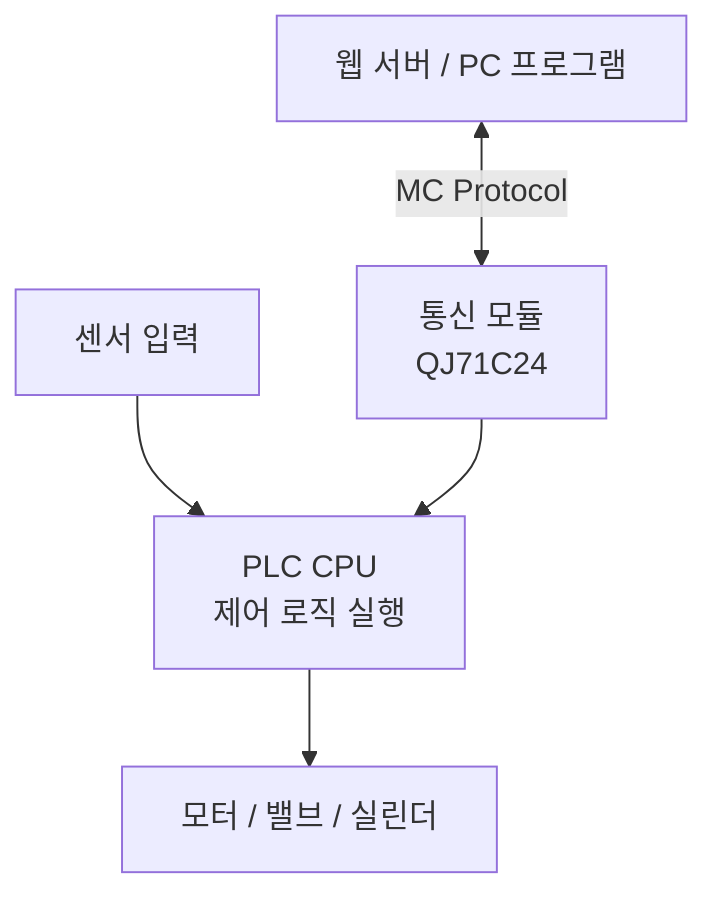
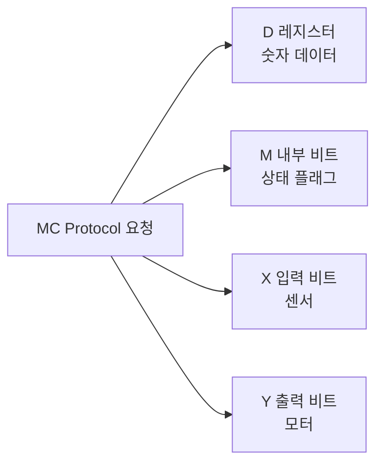
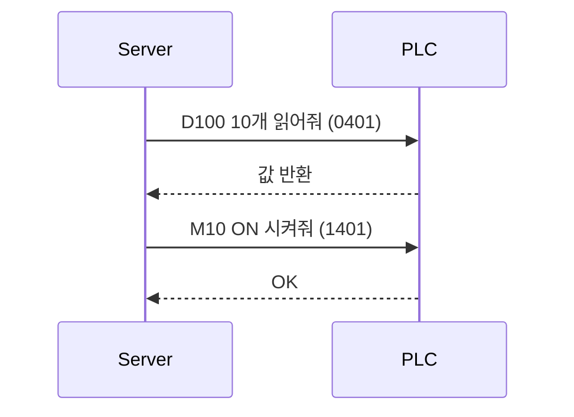
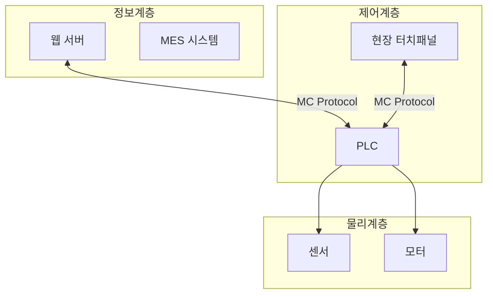

# PLC 및 MC Protocol 기초

## 1. PLC(Programmable Logic Controller)

### 1-1. PLC란 무엇인가?

PLC는 공장/산업 현장에서 장비를 실제로 제어하기 위한 **전용 산업용 컴퓨터**로써 **센서 입력을 읽고(입력), 로직을 실행해서(프로그램), 모터/밸브 같은 출력**을 제어하는 시스템입니다.

- 입력(Input): 센서, 버튼, 리미트 스위치 등
- 출력(Output): 모터 ON/OFF, 밸브 열기/닫기, 경광등 등
- 로직: "조건이 맞으면 이렇게 동작" 같은 제어 규칙(보통 래더/구조화 텍스트 등)

즉, PLC = "센서를 읽고 → 판단하고 → 장비를 움직이는 실시간 제어기"

### 1-2. 왜 PLC가 따로 필요한가?

PC(윈도우/리눅스)나 웹 서버로도 제어는 "이론상" 가능하지만, 산업 현장에서는 다음이 중요합니다.

- 전기 노이즈/전원 문제/진동 환경에서도 버텨야 합니다
- 입력/출력 주기(스캔)가 안정적이어야 합니다
- 갑자기 업데이트/재부팅으로 멈추면 큰 사고로 이어질 수 있습니다

그래서 PLC는 **장비 제어에 특화된 하드웨어 + 운영 방식**을 갖고 있습니다.

### PLC 하드웨어

<ImageGrid :images="[
  { src: '/blog/plc/images/plc-product.jfif', alt: 'PLC 제품' },
  { src: '/blog/plc/images/plc-module.webp', alt: 'PLC 모듈' },
  { src: '/blog/plc/images/mitsubishi-plc-panel.jpg', alt: 'Mitsubishi PLC 패널' },
  { src: '/blog/plc/images/plc-compact.jpg', alt: 'PLC 소형 모델' },
]" />

## 2. PLC의 동작 방식 (Scan Cycle)

PLC는 웹 서버처럼 "요청이 와야 동작"하지 않습니다. PLC는 항상 다음을 반복합니다:

이것을 **Scan Cycle(스캔 사이클)** 이라고 합니다. 보통 1~10ms 주기로 계속 반복됩니다.

## 3. PLC의 구조

- **CPU 모듈** → 프로그램 실행
- **입력 모듈** → 센서 신호 받음
- **출력 모듈** → 모터/밸브 제어
- **통신 모듈(QJ71C24 등)** → 외부 PC와 통신

## 4. PLC 디바이스 메모리 구조

| 디바이스 | 설명 | 타입 |
| --- | --- | --- |
| X | 입력 신호 | Bit |
| Y | 출력 신호 | Bit |
| M | 내부 상태 플래그 | Bit |
| D | 데이터 레지스터 | Word (16bit) |

예시)

- `D100` → 생산 수량
- `M10` → 설비 동작 상태
- `X0` → 시작 버튼
- `Y0` → 모터 ON

### 출력(Y)을 직접 제어하면 안 되는 이유

웹 서버가 MC Protocol로 `Y0 = ON`을 써도, 다음 스캔에서 PLC 프로그램이 다시 덮어쓸 수 있습니다.

따라서 산업 현장에서는:

> 외부는 M 또는 D를 수정하고, 최종 출력은 PLC 로직이 결정하도록 설계합니다.

## 5. MC Protocol이란?

MC Protocol은 Mitsubishi PLC에 접근하기 위한 통신 규약입니다. 외부 장치(PC, HMI, 서버 등)가 PLC의 디바이스 메모리를 읽고/쓸 수 있도록 하는 프로토콜입니다.

### 5-1. MC Protocol의 역할

즉, MC Protocol = PLC 내부 메모리를 원격에서 조작하는 API입니다.

### 5-2. 주요 명령어

| 명령 | 의미 |
| --- | --- |
| 0401 | Batch Read (일괄 읽기) |
| 1401 | Batch Write (일괄 쓰기) |

예시)

- `0401 D100 0003` → D100부터 3워드 읽기
- `1401 M10 0001` → M10 1개 쓰기

## 6. RS-232 / RS-485란?

MC Protocol은 "데이터 규약"이고, RS-232 / RS-485는 "전기적 통신 방식"입니다.

### RS-232

- 1:1 통신
- 짧은 거리 (15m 이하)
- 과거 PC-PLC 직접 연결

### RS-485

- 멀티드롭 (1:N)
- 긴 거리 (최대 1km 수준)
- 공장 노이즈 환경에 강함
- 차동 신호(A/B선)

### 계층 구조

## 7. 전체 계층 구조

### 7-1. 웹 개발 관점 비유

| 산업 자동화 | 웹 개발 |
| --- | --- |
| PLC | 실시간 제어 서버 |
| D/M/X/Y | 변수 / 상태값 |
| MC Protocol | 저수준 API |
| RS-485 | 물리 네트워크 |
| HMI | 관리자 UI |
| MES | 상위 비즈니스 시스템 |

## 전체 요약

- PLC는 **항상 반복 실행되는 실시간 제어기**입니다
- 디바이스(D/M/X/Y)는 PLC 내부 메모리입니다
- MC Protocol은 PLC 접근용 통신 규약입니다
- RS-232/485는 물리적 통신 방식입니다
- 외부 시스템은 PLC를 직접 제어하지 않고 **명령을 전달하는 역할**입니다
