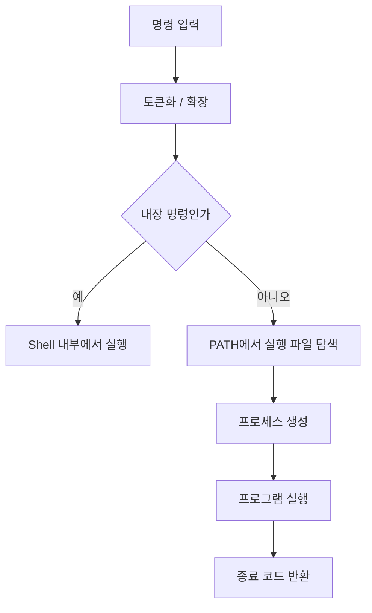
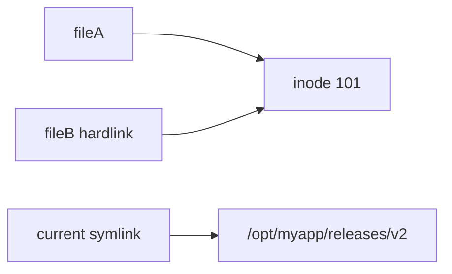
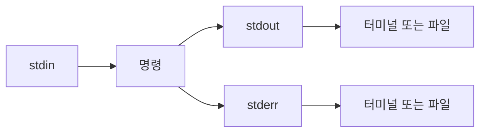

# 제2장. 셸과 Linux 파일시스템

## 장의 목표

이 장을 학습한 뒤에는 다음을 설명할 수 있어야 한다.

- 셸이 운영체제와 사용자 사이에서 어떤 역할을 하는지 설명할 수 있다.
- 명령이 입력된 뒤 실제로 어떻게 실행되는지 개략적으로 설명할 수 있다.
- 절대경로와 상대경로, 현재 작업 디렉터리의 의미를 구분할 수 있다.
- Linux 파일시스템 계층에서 주요 디렉터리의 역할을 설명할 수 있다.
- 일반 파일, 디렉터리, 링크, 디바이스 파일, 소켓, 파이프의 차이를 설명할 수 있다.
- 리다이렉션과 파이프를 이용해 명령을 연결하고 결과를 저장할 수 있다.
- 서버 관리자가 셸과 파일시스템을 이용해 시스템 상태를 읽는 기본 절차를 수행할 수 있다.

## 전제와 범위

이 장은 Ubuntu Server 환경을 기준으로 한다. 독자는 기본적인 CLI 사용 경험이 있다고 가정하지만, 셸의 내부 동작과 파일시스템 구조를 아직 체계적으로 정리하지 않았다고 본다.

이 장의 초점은 두 가지다.

1. 셸을 단순한 명령창이 아니라 운영체제 인터페이스로 이해하는 것
2. 파일시스템을 단순 저장 공간이 아니라 시스템 구조를 반영하는 계층으로 이해하는 것

권한 모델과 프로세스 제어는 다음 장에서 더 엄밀하게 다룬다. 이번 장에서는 먼저 셸과 파일시스템의 구조를 잡는다.

---

## 2.1 셸은 무엇인가

셸(shell)은 사용자의 명령을 읽고 해석하여 운영체제에 전달하는 프로그램이다. 커널이 운영체제의 핵심이라면, 셸은 사용자가 그 커널과 간접적으로 상호작용하는 대표적인 방법이다.

> **정의 2.1** — 셸은 사용자가 입력한 명령을 파싱하고, 필요한 경우 프로그램을 실행하며, 입출력을 연결하는 명령 해석기(command interpreter)다.

Ubuntu Server에서 셸이 중요한 이유는 단순하다. 서버는 대개 GUI보다 CLI 중심으로 운영되며, 원격 접속도 보통 SSH를 통해 이루어진다. 즉, 서버 관리자는 셸을 통해 시스템을 관찰하고, 수정하고, 자동화한다.

대표적인 셸에는 다음이 있다.

- bash
- sh
- zsh
- dash

Ubuntu Server에서 기본 로그인 셸로 bash를 접하는 경우가 많으므로, 이 장도 bash를 기준으로 설명한다.


이 그림에서 핵심은 셸이 직접 하드웨어를 다루는 것이 아니라, 명령을 해석하고 커널을 통해 실행을 요청한다는 점이다.

---

## 2.2 명령은 어떻게 실행되는가

사용자가 셸에 명령을 입력했을 때, 내부적으로는 생각보다 여러 단계가 일어난다.

예를 들어 다음 명령을 보자.

```bash
ls -al /etc
```

사용자는 보통 이것을 하나의 동작으로 인식하지만, 셸은 대략 다음 순서로 처리한다.

1. 입력 문자열을 읽는다.
2. 공백과 메타문자를 기준으로 토큰을 분리한다.
3. 변수 치환, 와일드카드 확장 같은 셸 확장을 수행한다.
4. 이것이 셸 내장 명령인지 외부 실행 파일인지 판별한다.
5. 외부 프로그램이면 실행 파일 경로를 찾는다.
6. 필요하면 새 프로세스를 생성하고 프로그램을 실행한다.
7. 종료 코드를 받아 다음 동작에 반영한다.

이 과정은 운영체제 과목에서 배우는 fork와 exec 개념과 연결된다. 실제로는 셸이 자식 프로세스를 만들고, 그 자식이 외부 프로그램으로 교체되는 형태로 이해하면 된다. 학부 수준에서는 "셸이 새 프로세스를 만들고 해당 프로그램을 실행한다" 정도로 이해해도 충분하다.



### 2.2.1 내장 명령과 외부 프로그램

셸 명령은 크게 두 부류로 나뉜다.

**셸 내장 명령**

셸 자체가 제공하는 명령이다. 예를 들어 `cd`, `echo`, `pwd`, `export` 등이 있다.

이 명령들은 단순한 편의 기능이 아니라, 셸 자신의 상태를 바꾸기 때문에 내장으로 존재하는 경우가 많다. 예를 들어 `cd`는 현재 셸의 작업 디렉터리를 바꿔야 하므로, 외부 프로그램으로는 충분하지 않다.

**외부 프로그램**

실행 파일 형태로 파일시스템 어딘가에 존재하는 프로그램이다. 예를 들어 `ls`, `cat`, `grep`, `find` 같은 도구들이 이에 해당한다.

운영자 입장에서는 이 둘을 구분할 수 있어야 한다. 같은 "명령"처럼 보이더라도 실행 방식과 위치가 다를 수 있기 때문이다.

다음 명령으로 확인할 수 있다.

```bash
type cd
type ls
command -v ls
which ls
```

`type`은 셸 내장 여부를 확인하는 데 특히 유용하다. `which`는 외부 실행 파일 경로를 보여주지만, 셸 alias나 built-in까지 완전히 설명하는 도구는 아니다. 운영에서는 `type`이나 `command -v`가 더 정확한 경우가 많다.

### 2.2.2 PATH의 의미

외부 프로그램을 실행할 때 셸은 사용자가 파일 전체 경로를 매번 입력하길 기대하지 않는다. 대신 `PATH` 환경변수에 등록된 디렉터리를 순서대로 검색한다.

예를 들어 `ls`를 실행하면 셸은 다음과 비슷한 검색을 한다.

```
/usr/local/sbin/ls
/usr/local/bin/ls
/usr/sbin/ls
/usr/bin/ls
...
```

찾는 파일이 존재하고 실행 가능하면 그 파일을 실행한다.

```bash
echo $PATH
```

운영 관점에서 PATH는 매우 중요하다. 잘못된 PATH 설정은 다음 문제를 낳을 수 있다.

- 의도한 프로그램이 아니라 다른 버전의 프로그램이 실행됨
- 특정 계정에서만 명령이 안 됨
- 자동화 스크립트가 interactive shell과 다르게 동작함

따라서 운영 스크립트에서는 중요한 명령에 절대경로를 쓰는 경우가 많다. 예를 들어 `tar` 대신 `/usr/bin/tar`처럼 명시하는 방식이다.

### 2.2.3 종료 코드와 성공/실패

대부분의 명령은 실행이 끝난 뒤 종료 코드를 반환한다. 전통적으로 0은 성공, 0이 아닌 값은 실패나 예외를 의미한다.

직전 명령의 종료 코드는 다음으로 확인한다.

```bash
echo $?
```

예:

```bash
ls /etc
echo $?      # 0 (성공)

ls /no-such-dir
echo $?      # 2 (실패)
```

운영에서 종료 코드는 자동화와 장애 감지에 직접 연결된다. 스크립트가 어떤 조건에서 실패했는지, 이전 단계가 성공했는지 확인할 때 필수다.

---

## 2.3 현재 작업 디렉터리와 경로

셸은 항상 어떤 디렉터리 안에서 동작한다. 이를 **현재 작업 디렉터리(current working directory)**라고 한다.

```bash
pwd
```

`pwd`는 "지금 내가 파일시스템의 어디에 있는가"를 알려준다. 이 개념이 중요한 이유는 상대경로가 항상 현재 작업 디렉터리를 기준으로 해석되기 때문이다.

예를 들어 현재 작업 디렉터리가 `/home/student`라면,

- `notes.txt` → `/home/student/notes.txt`
- `docs/report.txt` → `/home/student/docs/report.txt`
- `../shared/data.csv` → `/home/shared/data.csv`

### 2.3.1 절대경로와 상대경로

**절대경로**

루트 디렉터리 `/`부터 시작하는 경로다.

```
/etc/ssh/sshd_config
/var/log
/usr/bin/python3
```

절대경로는 현재 위치와 무관하게 항상 같은 대상을 가리킨다. 운영 문서와 스크립트에서 절대경로를 많이 쓰는 이유가 여기에 있다.

**상대경로**

현재 작업 디렉터리를 기준으로 해석되는 경로다.

```
./script.sh
../data/config.yaml
logs/app.log
```

상대경로는 입력이 짧고 편리하지만, 실행 위치가 달라지면 전혀 다른 대상을 가리킬 수 있다. 자동화와 운영 절차에서 상대경로는 편리함과 동시에 위험 요소가 될 수 있다.

### 2.3.2 특수 경로 기호

Linux 경로 해석에서 자주 쓰는 기호는 다음과 같다.

| 기호 | 의미 |
|------|------|
| `.` | 현재 디렉터리 |
| `..` | 부모 디렉터리 |
| `~` | 현재 사용자의 홈 디렉터리 |

```bash
cd ..
cd ~/projects
./run.sh
```

이 세 기호는 매우 자주 등장하므로, 의미를 기계적으로 기억하는 것이 아니라 경로 트리 안에서 어떻게 움직이는지 이해해야 한다.

```mermaid
flowchart TD
    A[/] --> B[home]
    B --> C[student]
    C --> D[projects]
    C --> E[notes]
    A --> F[etc]
    A --> G[var]
```

상대경로는 항상 현재 디렉터리에서 출발한다. 경로 오류는 이 기준점을 놓쳐서 자주 발생한다.

---

## 2.4 Linux 파일시스템 계층 구조

Linux 파일시스템은 하나의 트리 구조로 보인다. 루트는 `/`이고, 그 아래에 시스템 전체의 디렉터리가 계층적으로 배치된다.

이 구조는 단순한 분류가 아니라 운영체제 설계 관례를 반영한다. 즉, "파일이 어디에 놓이는가"는 그 파일의 역할과 수명주기를 어느 정도 암시한다.

```mermaid
flowchart TD
    A[/] --> B[etc]
    A --> C[var]
    A --> D[home]
    A --> E[usr]
    A --> F[opt]
    A --> G[tmp]
    A --> H[dev]
    A --> I[proc]
    A --> J[srv]
```

### 2.4.1 /etc : 설정의 중심

`/etc`는 시스템과 서비스의 설정 파일이 모여 있는 곳이다.

```
/etc/hosts
/etc/ssh/sshd_config
/etc/fstab
/etc/nginx/nginx.conf
```

운영자에게 `/etc`가 중요한 이유는 명확하다. 대부분의 서비스 동작 방식은 여기의 설정에 의해 결정되기 때문이다.

다만, `/etc`는 "데이터 저장소"가 아니다. 대형 로그나 애플리케이션 실행 데이터가 여기에 쌓이는 구조는 보통 잘못된 설계다.

### 2.4.2 /var : 변하는 데이터의 장소

`/var`는 가변적 데이터가 위치하는 곳이다.

| 경로 | 용도 |
|------|------|
| `/var/log` | 로그 |
| `/var/lib` | 서비스 데이터 |
| `/var/cache` | 캐시 |
| `/var/spool` | 대기 작업 |

운영에서 `/var`는 매우 자주 확인하는 위치다. 왜냐하면 서비스가 오래 실행될수록 로그와 상태 데이터가 누적되기 때문이다. 디스크가 갑자기 차는 문제도 대개 `/var/log` 또는 `/var/lib`에서 많이 발견된다.

### 2.4.3 /home : 일반 사용자 공간

`/home`은 일반 사용자들의 홈 디렉터리가 배치되는 곳이다.

```
/home/student
/home/admin
```

여기에는 사용자의 개인 설정, 작업 파일, 스크립트 등이 존재할 수 있다. 운영 관점에서는 "애플리케이션 실행 파일과 운영 데이터는 `/home`보다 더 명시적인 위치에 두는 편이 낫다"는 원칙을 기억하면 된다.

### 2.4.4 /usr : 프로그램과 라이브러리

`/usr`는 시스템이 제공하는 프로그램, 라이브러리, 문서 등이 위치하는 곳이다.

```
/usr/bin
/usr/sbin
/usr/lib
/usr/share
```

사용자가 `ls`, `grep`, `find` 같은 명령을 실행할 때 실제 실행 파일이 `/usr/bin` 아래에 있는 경우가 많다.

운영 관점에서는 `/usr`를 "패키지 관리 시스템이 주로 채우는 영역"으로 이해하면 편하다. 즉, 관리자가 직접 수정하는 공간이라기보다 패키지에 의해 관리되는 공간이다.

### 2.4.5 /opt : 별도 설치 애플리케이션

`/opt`는 패키지 관리 외의 별도 애플리케이션을 배치할 때 자주 쓰인다.

```
/opt/myapp
/opt/tools
```

사내 배포 바이너리나 압축을 풀어 설치한 서버 프로그램을 이곳에 두는 경우가 많다. 실무에서는 `/opt/<app-name>` 구조를 쓰면 운영 문서화가 쉬워지는 장점이 있다.

### 2.4.6 /tmp : 임시 파일 공간

`/tmp`는 일시적인 데이터를 저장하는 곳이다. 재부팅 후 정리되거나, 시스템 정책에 따라 자동 삭제될 수 있다.

따라서 운영 데이터나 영구 보존이 필요한 파일을 `/tmp`에 두는 것은 적절하지 않다.

### 2.4.7 /dev : 장치 파일

`/dev`는 디바이스를 파일처럼 다루게 하는 인터페이스다.

```
/dev/null
/dev/sda
/dev/tty
```

Linux에서는 많은 자원이 파일 인터페이스로 추상화되므로, 장치 접근도 이 디렉터리를 통해 이루어진다.

### 2.4.8 /proc : 커널과 프로세스 정보의 가상 파일시스템

`/proc`는 실제 디스크에 저장된 일반 파일 모음이 아니라, 커널이 동적으로 제공하는 가상 파일시스템이다.

```
/proc/cpuinfo
/proc/meminfo
/proc/<pid>/
```

운영자는 `/proc`를 통해 시스템 상태를 읽을 수 있다. 즉, Linux는 단순히 파일을 저장하는 파일시스템만이 아니라, 시스템 내부 상태를 파일처럼 노출하는 구조를 제공한다.

---

## 2.5 파일의 종류

초보자는 파일을 보통 "내용이 저장된 일반 파일" 정도로 생각한다. 그러나 Linux에서 파일은 더 넓은 개념이다.

> **정의 2.2** — Linux에서 파일은 파일시스템 객체를 다루기 위한 일반화된 인터페이스다.

즉, 디렉터리도 파일이고, 장치도 파일처럼 보이며, 소켓이나 파이프도 파일시스템 관점에서 다뤄질 수 있다.

### 2.5.1 일반 파일

텍스트, 바이너리, 이미지, 로그 등 우리가 흔히 생각하는 파일이다. 예: `notes.txt`, `server.jar`, `access.log`

### 2.5.2 디렉터리

디렉터리는 다른 파일 이름과 그 참조를 담는 특별한 파일이다. 운영체제 관점에서는 "파일을 담는 폴더"로 이해해도 좋지만, 더 정확히는 이름을 inode에 연결하는 엔트리 집합에 가깝다.

### 2.5.3 심볼릭 링크

심볼릭 링크(symbolic link)는 다른 경로를 가리키는 별도 파일이다.

```bash
ln -s /opt/myapp/releases/2026-04-02 current
```

이 경우 `current`는 실제 데이터가 아니라 다른 경로를 참조한다. 배포 시스템에서 매우 자주 쓰인다.

심볼릭 링크의 장점은 대상을 바꾸기 쉽다는 점이다. 예를 들어 새 버전 배포 시 `current` 링크만 바꾸면 된다.

### 2.5.4 하드 링크

하드 링크는 같은 inode를 여러 이름으로 참조하는 구조다. 심볼릭 링크와 달리, 별도의 "참조 파일"이 아니라 같은 데이터 객체에 대한 또 다른 이름이다.

학부 수준에서는 다음 정도를 기억하면 충분하다.

- 심볼릭 링크는 "경로 참조"
- 하드 링크는 "같은 inode에 대한 다른 이름"

운영 실무에서는 심볼릭 링크를 훨씬 자주 다룬다.



### 2.5.5 디바이스 파일, 소켓, 파이프

**디바이스 파일** — 하드웨어 장치를 파일처럼 접근하기 위한 인터페이스다.

**소켓** — 프로세스 간 통신 또는 네트워크 통신에 사용되는 엔드포인트다. UNIX domain socket은 파일시스템에 파일처럼 나타날 수 있다.

**파이프** — 한 프로세스의 출력을 다른 프로세스의 입력으로 전달하는 통로다. 셸의 `|` 파이프와 연결되는 개념이다.

이처럼 Linux에서 파일시스템은 단순한 저장 공간이 아니라, **시스템 자원을 통일된 방식으로 접근하게 하는 모델**이다.

### 2.5.6 inode와 파일 이름

파일 이름과 파일 내용은 같은 것이 아니다. 이 구분을 이해하면 파일시스템 동작이 훨씬 명확해진다.

- **파일 이름**은 사람이 보는 식별자
- **inode**는 운영체제가 파일 메타데이터와 데이터를 추적하는 내부 단위

디렉터리는 "이 이름이 어느 inode를 가리키는가"를 저장한다. 이 구조 때문에 하드 링크가 가능하고, 파일 이름을 바꿔도 실제 데이터 객체는 그대로 유지될 수 있다.

```bash
ls -li
stat file.txt
```

이번 장에서는 inode를 깊게 파고들지는 않지만, 이름과 객체가 분리된다는 관점은 기억할 필요가 있다.

---

## 2.6 파일을 읽고 탐색하는 기본 도구

운영자는 파일을 자주 다룬다. 그렇다고 모든 파일을 에디터로 여는 것은 비효율적이고 때로는 위험하다. 먼저 읽기 중심 도구를 익히는 것이 좋다.

### 2.6.1 ls : 디렉터리 내용 보기

```bash
ls
ls -al
ls -lh
```

| 옵션 | 의미 |
|------|------|
| `-a` | 숨김 파일 포함 |
| `-l` | 상세 정보 |
| `-h` | 사람이 읽기 쉬운 크기 |

운영에서 `ls -al`은 거의 기본 동작이다. 숨김 파일과 권한, 소유자, 파일 크기, 수정 시각을 함께 볼 수 있기 때문이다.

### 2.6.2 file : 파일 유형 추정

확장자만으로 파일 종류를 판단하지 말고 `file` 명령으로 확인할 수 있다.

```bash
file /bin/ls
file /etc/passwd
file archive.tar.gz
```

운영 관점에서는 어떤 파일이 텍스트인지, 바이너리인지, 압축 파일인지 먼저 확인하는 습관이 중요하다.

### 2.6.3 stat : 메타데이터 확인

```bash
stat /etc/hosts
```

`stat`은 파일 크기, inode, 권한, 수정 시각 등 더 자세한 정보를 보여준다. 나중에 권한 문제나 링크 문제를 분석할 때 매우 유용하다.

### 2.6.4 cat, less, head, tail

**cat** — 파일 전체 내용을 출력한다.

```bash
cat /etc/hosts
```

짧은 파일에는 유용하지만, 큰 로그 파일에는 적절하지 않다.

**less** — 긴 파일을 페이지 단위로 읽을 수 있다.

```bash
less /var/log/syslog
```

운영자가 가장 자주 쓰는 읽기 도구 중 하나다.

**head, tail** — 파일의 앞부분이나 뒷부분을 본다.

```bash
head -20 /etc/passwd
tail -50 /var/log/syslog
```

로그는 최근 줄이 중요하므로 `tail`을 자주 사용한다.

### 2.6.5 find : 파일 탐색

파일시스템에서 특정 조건의 파일을 찾을 때는 `find`를 쓴다.

```bash
find /etc -name "*.conf"
find /var/log -type f
find /home/student -type l
```

`find`는 단순 검색 도구가 아니라, 파일시스템을 조건 기반으로 탐색하는 강력한 도구다. 운영에서는 설정 파일 찾기, 로그 위치 추적, 링크 탐색, 오래된 파일 찾기에 자주 쓰인다.

---

## 2.7 표준 입출력과 리다이렉션

셸이 강력한 이유는 단순히 명령을 실행하기 때문이 아니다. 명령들의 입출력을 연결할 수 있기 때문이다.

대부분의 명령은 세 개의 기본 스트림을 가진다.

- **표준 입력(stdin)**
- **표준 출력(stdout)**
- **표준 에러(stderr)**

운영자는 이 세 흐름을 의식적으로 다룰 수 있어야 한다.



### 2.7.1 출력 리다이렉션

```bash
ls -al /etc > etc-list.txt
```

이 명령은 표준 출력을 파일로 보낸다. 기존 파일이 있으면 덮어쓴다.

추가 쓰기는 `>>`를 쓴다.

```bash
echo "done" >> run.log
```

에러 출력만 따로 저장하려면 `2>`를 쓴다.

```bash
ls /no-such-dir 2> error.log
```

stdout과 stderr를 분리할 수 있다는 점은 운영 자동화에서 매우 중요하다. 정상 출력과 오류 메시지를 섞지 않고 관리할 수 있기 때문이다.

### 2.7.2 입력 리다이렉션

```bash
wc -l < /etc/passwd
```

이 명령은 `/etc/passwd`의 내용을 표준 입력으로 넣어 줄 수를 센다.

실무에서는 출력 리다이렉션과 파이프를 더 많이 쓰지만, 입력 리다이렉션도 배치 작업에서 자주 보인다.

---

## 2.8 파이프와 명령 조합

파이프 `|`는 한 명령의 표준 출력을 다음 명령의 표준 입력으로 전달한다.

```bash
cat /etc/passwd | grep root
```

이는 `/etc/passwd` 내용을 읽어 `grep root`에 넘긴다. 더 일반적으로는 다음처럼 이해하면 된다. **첫 번째 명령이 데이터를 생산하고, 두 번째 명령이 그 데이터를 소비한다.**


### 2.8.1 파이프라인 예시

```bash
ls -al /etc | less
ps aux | grep nginx
find /etc -name "*.conf" | wc -l
```

이 구조는 매우 중요하다. 셸에서는 하나의 거대한 도구보다, 작은 도구 여러 개를 연결하는 방식이 핵심 설계 철학이기 때문이다.

운영자는 이 철학을 이해해야 한다. 예를 들어 "로그를 읽는다 → 특정 키워드를 걸러낸다 → 개수를 센다" 같은 작업을 명령 조합으로 빠르게 수행할 수 있다.

### 2.8.2 텍스트 처리의 기초 도구

이번 장에서 꼭 익혀둘 만한 도구는 다음 정도다.

**grep** — 패턴이 포함된 줄을 찾는다.

```bash
grep ssh /etc/services
grep -i error app.log
```

**wc** — 줄 수, 단어 수, 바이트 수를 센다.

```bash
wc -l /etc/passwd
```

**sort, uniq** — 정렬하거나 중복을 처리한다.

```bash
sort names.txt
sort names.txt | uniq
```

**cut** — 특정 필드만 뽑아낸다.

```bash
cut -d: -f1 /etc/passwd
```

이 도구들은 각각 단순하지만, 파이프와 결합되면 매우 강력하다.

---

## 2.9 서버 관리자의 셸 사용 방식

셸은 단순한 사용 도구가 아니라 **관찰 도구**다. 서버 관리자는 셸을 이용해 시스템의 현재 상태를 빠르게 읽는다.

예를 들어 다음 질문들을 보자.

- 어떤 설정 파일이 존재하는가
- 어떤 서비스 로그가 어디에 저장되는가
- 특정 이름의 파일이 시스템 어디에 있는가
- 이 서버의 실행 파일이 어느 경로에 있는가
- 어떤 디렉터리에서 용량이 많이 사용되는가

이 질문들은 모두 셸과 파일시스템 도구로 시작할 수 있다.

```bash
command -v nginx
find /etc -name "nginx.conf"
ls -al /var/log
du -sh /var/*
file /usr/bin/python3
```

운영자가 셸을 잘 다룬다는 말은, 복잡한 GUI 없이도 시스템 상태를 구조적으로 관찰할 수 있다는 뜻이다.

### 2.9.1 서버 운영에서 자주 하는 실수

**현재 위치를 확인하지 않고 작업** — 상대경로를 잘못 해석해 엉뚱한 파일을 수정할 수 있다.

**큰 파일을 cat으로 바로 출력** — 터미널을 불필요하게 오염시키거나, 로그 읽기가 비효율적일 수 있다.

**설정 파일과 런타임 데이터를 구분하지 못함** — `/etc`와 `/var`의 차이를 이해하지 못하면 문제 위치를 잘못 찾는다.

**리다이렉션으로 파일을 덮어씀** — `>`는 append가 아니라 overwrite다. 운영에서는 덮어쓰기 여부를 항상 의식해야 한다.

**PATH 차이를 고려하지 않음** — interactive shell에서는 되는데 systemd 서비스나 cron에서는 안 되는 문제의 원인이 될 수 있다.

---

## 2.10 요약

이 장에서 기억해야 할 핵심은 다음과 같다.

1. 셸은 단순 입력창이 아니라 명령 해석기이자 프로세스 실행 인터페이스다.
2. Linux 파일시스템은 단순 저장 공간이 아니라 시스템 구조를 표현하는 계층이다.
3. 파일은 일반 파일만을 뜻하지 않으며, 디렉터리, 링크, 장치, 소켓, 파이프까지 포함하는 넓은 개념이다.
4. 리다이렉션과 파이프는 작은 명령들을 조합해 강력한 관찰 도구를 만들게 해 준다.
5. 서버 관리자는 셸을 통해 시스템을 읽고, 파일시스템 구조를 통해 문제 위치를 추정한다.

다음 장에서는 이 기반 위에 사용자, 권한, 프로세스를 올려서 더 엄밀하게 다룬다.

---

## 실습 해설

이 절에서는 제2장의 개념을 실제 Ubuntu Server에서 어떻게 확인하는지 단계적으로 설명한다. 목표는 "명령을 외우는 것"이 아니라, 셸과 파일시스템을 읽는 절차를 몸에 익히는 것이다.

### 실습 1. 셸은 명령을 어떻게 찾는가

**목표** — 셸 내장 명령과 외부 프로그램의 차이를 확인하고, PATH가 명령 실행에 어떤 역할을 하는지 이해한다.

**사용 명령**

```bash
type cd
type ls
command -v ls
which ls
echo $PATH
```

#### 1단계. cd와 ls를 비교한다

```bash
type cd
type ls
```

예상 해석은 다음과 같다.

- `cd`는 shell builtin
- `ls`는 `/usr/bin/ls` 같은 외부 프로그램

이 차이는 매우 중요하다. `cd`는 현재 셸의 작업 디렉터리를 바꿔야 하므로, 단순 외부 실행 파일이 아니라 셸 내부 기능으로 존재한다.

#### 2단계. 실제 실행 파일 위치를 찾는다

```bash
command -v ls
which ls
```

대개 `/usr/bin/ls`가 나온다. 이 결과는 "ls라는 이름이 실제 파일시스템의 어느 실행 파일로 연결되는가"를 보여준다.

운영 관점에서 중요한 이유는 다음과 같다.

- 여러 버전의 명령이 공존할 수 있다.
- 계정이나 환경에 따라 다른 실행 파일이 선택될 수 있다.
- 스크립트는 절대경로를 써야 더 예측 가능할 수 있다.

#### 3단계. PATH를 확인한다

```bash
echo $PATH
```

여러 디렉터리가 `:`로 구분되어 나타난다. 셸은 이 순서대로 명령을 탐색한다.

해석 포인트는 다음과 같다.

- 앞쪽 디렉터리가 우선순위가 높다.
- 사용자별 환경설정으로 PATH가 달라질 수 있다.
- systemd나 cron 환경에서는 PATH가 더 짧거나 다를 수 있다.

즉, "터미널에서는 되는데 서비스에서는 안 된다"는 문제는 종종 PATH 차이에서 출발한다.

#### 실습 1의 핵심 해설

이 실습에서 익혀야 하는 것은 한 문장으로 정리할 수 있다.

> 셸은 명령 문자열을 곧바로 마법처럼 실행하는 것이 아니라, 내장 명령인지 판별하고, 아니면 PATH를 따라 실행 파일을 찾아 실행한다.

이 모델을 이해하면 실행 실패의 원인을 훨씬 구조적으로 볼 수 있다.

---

### 실습 2. 파일시스템 계층을 직접 읽어 보기

**목표** — 루트 디렉터리 아래 주요 시스템 디렉터리를 확인하고, 각 디렉터리의 운영적 역할을 구분한다.

**사용 명령**

```bash
pwd
ls /
ls -al /
ls -al /etc
ls -al /var
ls -al /home
ls -al /proc | head
```

#### 1단계. 현재 위치와 루트 구조를 확인한다

```bash
pwd
ls -al /
```

루트 아래에 어떤 디렉터리가 있는지 먼저 본다. 여기서 중요한 것은 이름을 보는 것이 아니라 역할을 추정하는 것이다.

- 설정 파일은 어디에 있을까
- 로그는 어디에 있을까
- 사용자별 작업 공간은 어디일까
- 프로그램 바이너리는 어디에 있을까

#### 2단계. /etc와 /var를 비교한다

```bash
ls -al /etc
ls -al /var
```

`/etc`는 상대적으로 설정 중심, `/var`는 변화하는 데이터 중심이라는 점을 관찰한다.

운영 관점에서는 다음처럼 읽어야 한다.

- 설정 변경 문제는 `/etc`에서 찾을 가능성이 높다.
- 로그 폭증이나 상태 데이터 문제는 `/var`에서 찾을 가능성이 높다.

즉, 디렉터리 구조 자체가 문제 위치를 추정하는 힌트다.

#### 3단계. /home과 /proc를 비교한다

```bash
ls -al /home
ls -al /proc | head
```

`/home`은 사용자의 실제 작업 공간이다. 반면 `/proc`는 커널이 제공하는 가상 정보 공간이다.

이 차이를 이해하는 것이 중요하다. 둘 다 "디렉터리처럼 보이지만" 내부 성격은 다르다.

- `/home/student/report.txt`는 실제 파일일 가능성이 높다.
- `/proc/cpuinfo`는 커널 상태를 노출하는 가상 파일이다.

Linux에서는 "파일처럼 보인다"가 곧 "일반 파일이다"를 의미하지 않는다.

#### 실습 2의 핵심 해설

> 파일시스템 구조는 임의의 폴더 모음이 아니라, 시스템 구성과 운영 흐름을 반영하는 지도다.

Ubuntu Server를 읽을 때는 이 지도를 기준으로 문제 위치를 좁혀 나가야 한다.

---

### 실습 3. 파일 유형과 링크 확인하기

**목표** — 일반 파일, 디렉터리, 심볼릭 링크의 차이를 실제로 확인하고, 링크가 운영에 왜 유용한지 이해한다.

**사용 명령**

```bash
mkdir -p ~/chapter2-demo
cd ~/chapter2-demo
echo "version1" > app.txt
ln -s app.txt current
ls -al
file app.txt
file current
stat app.txt
stat current
readlink current
```

#### 1단계. 실습 디렉터리를 준비한다

```bash
mkdir -p ~/chapter2-demo
cd ~/chapter2-demo
echo "version1" > app.txt
```

여기까지 하면 일반 텍스트 파일 `app.txt`가 하나 생긴다.

#### 2단계. 심볼릭 링크를 만든다

```bash
ln -s app.txt current
ls -al
```

`current -> app.txt` 같은 형태가 보일 것이다. 이 화살표 표기는 `current`가 실제 내용 저장 파일이 아니라 다른 경로를 가리키는 링크임을 뜻한다.

#### 3단계. 파일 종류를 확인한다

```bash
file app.txt
file current
```

`app.txt`는 텍스트 파일로, `current`는 symbolic link로 표시될 가능성이 높다.

#### 4단계. 메타데이터와 링크 대상 확인

```bash
stat app.txt
stat current
readlink current
```

`stat`은 각 객체의 메타데이터를 보여준다. `readlink`는 심볼릭 링크가 가리키는 실제 대상을 보여준다.

운영에서 심볼릭 링크가 유용한 이유는 명확하다.

- 배포 시 새 버전 디렉터리를 만든 뒤 링크만 교체할 수 있다.
- 설정이나 데이터 경로를 논리 이름으로 분리할 수 있다.
- 원본 파일 위치를 바꾸더라도 참조점을 유지하기 쉽다.

#### 실습 3의 핵심 해설

> 링크는 단순 복사본이 아니라, 이름과 실제 대상을 분리하는 운영 도구다.

이 개념을 이해하면 나중에 배포 구조, 로그 경로, 현재 버전 포인터 같은 운영 패턴을 쉽게 이해할 수 있다.

---

### 실습 4. 리다이렉션과 파이프로 결과를 저장하고 가공하기

**목표** — 표준 출력, 표준 에러, 파이프를 이용해 명령 결과를 저장하고, 필요한 정보만 걸러내는 방법을 익힌다.

**사용 명령**

```bash
ls -al /etc > etc-list.txt
head -5 etc-list.txt
ls /no-such-dir 2> err.txt
cat err.txt
ls -al /etc | grep ssh
cut -d: -f1 /etc/passwd | head
wc -l < /etc/passwd
```

#### 1단계. 출력 저장

```bash
ls -al /etc > etc-list.txt
head -5 etc-list.txt
```

이 명령은 `/etc` 목록을 파일로 저장한 뒤, 앞부분만 확인한다.

- `>`는 stdout을 파일로 보낸다.
- 큰 결과를 바로 터미널에 출력하지 않고 파일로 남길 수 있다.
- 운영 증적이나 임시 분석 결과 저장에 유용하다.

#### 2단계. 에러만 분리 저장

```bash
ls /no-such-dir 2> err.txt
cat err.txt
```

`ls` 실패 메시지는 stdout이 아니라 stderr로 나온다. 따라서 `2>`를 써야 에러만 파일에 저장된다.

운영에서는 정상 결과와 오류 로그를 분리하는 습관이 중요하다. 스크립트 자동화나 장애 분석에서 매우 큰 차이를 만든다.

#### 3단계. 파이프로 결과를 걸러낸다

```bash
ls -al /etc | grep ssh
```

`ls -al /etc`의 결과를 `grep ssh`로 넘겨 ssh 관련 항목만 찾는다. 이것은 "먼저 전체를 보고, 그다음 필요한 것만 골라낸다"는 셸 철학의 가장 기본적인 예다.

#### 4단계. 필드 추출과 줄 수 세기

```bash
cut -d: -f1 /etc/passwd | head
wc -l < /etc/passwd
```

첫 번째 명령은 `/etc/passwd`에서 첫 번째 필드, 즉 사용자 이름만 추출한다. 두 번째 명령은 파일 줄 수를 센다.

즉, 셸은 단순 실행기가 아니라 작은 텍스트 처리 파이프라인을 빠르게 구성하는 도구다.

#### 실습 4의 핵심 해설

> 셸에서는 하나의 큰 프로그램보다, 출력과 입력을 연결하는 작은 도구 조합이 더 중요하다.

이 감각이 생기면 서버 관찰과 자동화가 훨씬 쉬워진다.

---

### 실습 5. 설정 파일과 텍스트 파일 찾기

**목표** — `find`를 이용해 파일시스템을 조건 기반으로 탐색하고, 운영에서 필요한 파일을 빠르게 찾는 기본 절차를 익힌다.

**사용 명령**

```bash
find /etc -type f -name "*.conf" | head
find /etc -type f | wc -l
find ~/chapter2-demo -type l
find /var/log -type f 2>/dev/null | head
```

#### 1단계. 설정 파일을 찾는다

```bash
find /etc -type f -name "*.conf" | head
```

이 명령은 `/etc` 아래의 `.conf` 파일 일부를 보여준다. 운영에서는 특정 서비스 설정 파일 위치를 추적할 때 이런 방식으로 범위를 좁힌다.

#### 2단계. 특정 타입만 센다

```bash
find /etc -type f | wc -l
```

이 명령은 `/etc` 아래 일반 파일 수를 센다. 숫자 자체보다 중요한 것은 `find`와 `wc`를 조합해 질문을 수량화할 수 있다는 점이다.

#### 3단계. 링크만 찾는다

```bash
find ~/chapter2-demo -type l
```

이 명령은 실습 디렉터리 안의 심볼릭 링크만 찾는다. 배포 구조나 로그 디렉터리 구조를 분석할 때 유용하다.

#### 4단계. 로그 파일 영역을 조심스럽게 본다

```bash
find /var/log -type f 2>/dev/null | head
```

`2>/dev/null`은 권한 오류 같은 stderr를 버리는 예다. 모든 상황에서 권장되는 것은 아니지만, 탐색 과정에서 불필요한 오류 메시지를 숨기고 싶을 때 사용한다.

다만 운영에서는 오류를 무조건 버리기보다, 왜 오류가 발생했는지 알고 사용하는 것이 중요하다.

#### 실습 5의 핵심 해설

> `find`는 "파일 이름 찾기"를 넘어, 파일시스템을 조건 기반으로 질문하는 도구다.

운영자는 파일시스템을 눈으로만 훑지 않고, 조건식으로 좁혀서 탐색해야 한다.

---

## 장 마무리

제2장의 핵심은 셸과 파일시스템을 별개의 주제로 보지 않는 것이다. 셸은 파일시스템 위의 명령과 데이터를 다루는 인터페이스이고, 파일시스템은 셸이 관찰하고 조작하는 대상이다.

이 장에서 가장 중요한 한 문장은 다음이다.

> **서버 관리자는 셸을 통해 시스템을 관찰하고, 파일시스템 구조를 통해 시스템의 역할과 문제 위치를 추론한다.**
